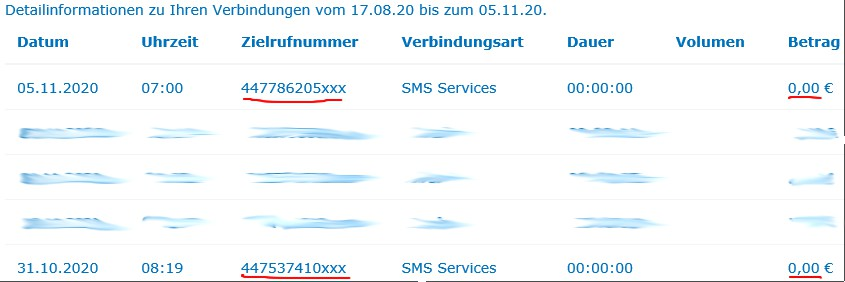

This repo provides some info on how to downgrade, jailbreak, and setup IOS 10.3.3 on an iPhone 5s.

The "install" script in this repo lists all post-jailbreak steps, so use that one in addition to this readme to guide you.

This repo provides sources only. The full package can be downloaded from the releases section:

	https://github.com/WRFan/jailbreak10.3.3/releases

It contains everything from this repo, as well as anything else mentioned in the "install" script (debian install packages, iPhoneOS10.3.sdk, iPhoneOS10.3_headers, compiled files etc.). To compile yourself, refer to:

https://github.com/WRFan/jailbreak10.3.3/blob/main/Packs/README.md

Pre-compiled libraries are also available (github releases section).

Disclaimer:

Unless otherwise noted, all binary files are property of procurs.us + bingner.com + newosxbook.com ; all sources ("Packs" folder on this repo) are forked from the respective repos on github. I hope it's ok with you, guys; if you are the owner of a specific file I provide and want me to explicitly mention you, add a new topic to

	https://github.com/WRFan/jailbreak10.3.3/issues

Considering the dpkg packs, I wouldn't even provide them, but the problem is, the repos delete old files when updates are available, replacing them by new ones, which often contain symbols that are not available on IOS 10.3.3, so I'd like to keep the files online for the people who are still on 10.3.3.

1. Downgrade:

The files needed to downgrade are inside the "downgrade" directory on this repo. I was using a Mac Sierra for that. The files are a fork from:

	https://github.com/MatthewPierson/Vieux

You will need that repo to downgrade. However, this Vieux guy has some annoying errors in his python scripts. First, this guy seems to be unaware of the fact that an iPhone (at least, this particular model) will NOT stay in DFU mode forever. It will auto-exit this mode in like 10 minutes, so you have a limited window to install new firmware. This weird behaviour is not downgrade specific. The official Apple forums are full of complaints about this issue - people try to upgrade the iOS system, iTunes takes some time to download the firmware, then it attempts to install the downloaded firmware - too late! iPhone exits DFU mode. Apple specifically suggests to DOWNLOAD the system to your hard disk first to reduce the installation duration. Now look at what this guy is doing - his script will first put the device into pwned DFU Mode (which is a pain in the ars*, because it takes like 35 times average to succeed), THEN he creates the custom ipsw ("createCustomIPSW64" function inside "ipsw.py"). He thinks iPhone will patiently wait until his script is done! Of course, by the time his script is done, iPhone exits DFU, which means you have to start all over!

Furthermore, he removes all created files on each attempt, meaning he re-creates the "custom.ipsw" all over again every time, and iPhone exits DFU right before or during the downgrade, all over! Now, why is he deleting the custom ipsw?!! This file needs to be created only ONCE, it can be used for any iPhone 5s, so the entire "createCustomIPSW64" function needs to be executed only once, and BEFORE the iPhone is put into DFU mode.

The "createCustomIPSW64" also zips "._058-74917-062.dmg" file from the original ipsw at:

	https://ipsw.me/download/iPhone6,2/14G60

Be careful about files containing a dot at the start of the name. If you create a backup of the downgrade folder by copying the folder through Mac Finder (that's the equivalent of Windows Explorer for us Winnies, lol), this file will NOT be copied, so this may cause the downgrade scripts to fail. I don't even think this file is necessary for the downgrade. You can probably comment out that line inside the "createCustomIPSW64" function. If you insist on copying it, you need to copy the folder through the Mac terminal (== cmd)

Overall, it's best to create custom.ipsw once and be done with it.

After putting my iPhone like 1 trillion times into pwned DFU mode and failing to upgrade due to errors in the original scripts, I finally got a little further, only to be presented with a cryptic failure message. So I executed the individual steps manually through the terminal and... tsschecker and irecovery from:

	https://github.com/MatthewPierson/Vieux/tree/master/resources/bin

threw:

	Killed: 9

Oh. My. God. This. Is. NOT. Happening! This guy actually forgot to add the damn entitlements! Has he even tested his damn scripts?!!!

	ldid -S irecovery

	ldid -S tsschecker

If you want to edit linux or darwin scripts on Windows, do NOT forget the damn carriage return problem! "\r\n" is the standard Windows way of line breaking, but some programmes (yes, radvd and python, I'm looking at you!) will complain about improper syntax, because darwin expects "\r" and unix "\n" (if I remember correctly), so make sure you format your plain text files properly before uploading them to non-windows systems. Again, some files downloaded off the Mac will look extremely weird in most Windows text editors, Winword is the only programme that can format the darwin stuff properly. The carriage return is also a constant source of trouble when dealing with regex in ANY language. Will there EVER be an end to this relict of the past or are you going to drag it with us forever?!!

If you are going to edit the python scripts, be aware that this insane language uses indents (tabs and spaces) for statements following conditionals where sane languages use {} and that tabs and spaces are NOT interchangeable. You don't want to go through the pain of setting the device in pwned DFU mode just to find out there's an error in your script, because you mixed tabs and spaces or something.

Now let us go over the downgrade process step by step.

First, get the files from the repo I mentioned and edit the scripts; again, check the "downgrade" folder on this repo, but don't just stupidly overwrite the vanilla scripts by my versions, because I, e.g., disabled the function responsible for the creation of "custom.ipsw", since I already created it, but you still got to run it once. So my version of "ipsw.py" says:

	pwndfumode()

	restore64(devicemodel)

and you need to do once:

	pwndfumode()

	createCustomIPSW64(devicemodel)

then you can switch off the "createCustomIPSW64" function and proceed with "restore64" directly.

This folder contains the files required for downgrade:

	https://github.com/MatthewPierson/Vieux/tree/master/resources/bin

Now, this is weird, but the "futurerestore" executable can NOT be updated with a newer version from here:

	https://github.com/tihmstar/futurerestore/releases

The downgrade will simply fail. The other files can be updated, but again, check the damn entitlements!

The python scripts require, surprise! python + some additional python modules:

	https://github.com/MatthewPierson/Vieux/blob/master/requirements.txt

plus you need ldid as well, so most people will tell you to use homebrew to install this stuff on Mac. Don't. This programme is extremely annoying. It will refuse to run as root, took me like an hour to kill that stupid useless check. Most people say it's extremely important not to run homebrew as root. Important my ass! Plus it puts installed files in non-standard folders, like services usually go to

	/System/Library/LaunchDaemons

and homebrew puts them somewhere else and tells you to run services through itself, what, something wrong with "launchctl"? It will also fill your entire hard disk with useless crap files, makes it nearly impossible to downgrade to lower versions, has problems with non-standard repos etc. etc. Install programmes directly, your OS will be grateful and you'll save some nerves.

Second, put the device into DFU mode, google it, also check the specs if you are interested:

	https://usb.org/sites/default/files/DFU_1.1.pdf

Third, run the checkm8 exploit. I actually run this exploit separately:

1st terminal window:

	ipwndfu -p

then, if the device is pwned successfully, I execute the actual downgrade in a second terminal window through:

	https://github.com/WRFan/jailbreak10.3.3/blob/main/downgrade/vieux

Prepare everything beforehand, because, as I said, the device will not stay in DFU mode forever!

Now, I'm not going to explain what the checkm8 exploit does, it's been all over the news. Everybody will tell you how great it is, but let me share some experience I had with it. First, the ipwndfu exploit takes ages to succeed (35-40 times average), so not so "extraordinary" from my point of view. Second, the checkra1n programme (based on this exploit):

	https://checkra.in

This damn programme is the very reason why I downgraded in the first place, because at that time unc0ver hasn't yet released an exploit for iOS 12.4.7 I had installed, so I was stuck with checkra1n. Now, I don't know the current state of development, nor do I give a damn about it any longer. The developer used to say "linux and mac supported", but that's a lie, linux was not supported, and probably still isn't. I tried to jailbreak through VMWare virtual machine, the app just crashed. Well, the developer will tell you not to use a virtual machine. So I cloned the virtual machine to an usb stick, booted from it, executed the programme, and it crashed again on the same step! So I checked github, the developer says, linux is not supported, but on his webpage he states, it's supported. Are we going to trust a guy who's lying in our faces?!

Yet another silliness: I've got a 32-bit linux OS. So I was looking for an "i386" version on the checkra page. Nada. Instead, he lists "i486". Now, what's that? I know! it's the 486 pre-Pentium intel CPU! So no "i386"? Turns out, "i486" is his double-talk for "i386".

So, on Mac Sierra this jailbreak was running without problems... or so I thought, because after some time you'll notice the app will crash on a Mac very often too.

So since the jailbreak was working on Mac (well, sometimes), and since I don't own a Mac (the Mac I used belongs to a friend), I was thinking about creating a Hackintosh to run the app on PC. Now creating a Hackintosh is a science for itself, so it took me ages to create an usb stick with a Mac on it, there are also some github repos that provide such usb images, but then I actually booted the system, and you know, how long it takes for it to boot? 8 fuc*ing minutes! That's every time you need to jailbreak! Plus you need to plug the device into your computer, extremely inconvenient. Plus I never got the damn mouse working, and I use a standard Microsoft wired mouse.

Also, the press gets all euphoric, telling you how this exploit cannot be fixed, because it's iBoot magic, so not dependent on software. Really? Try to jailbreak an iPhone 5s (hardware supported by checkra1n) running iOS 10.3.3. checkra1n will say "unsupported". How interesting! So it IS dependent on software! So there's the super-duper checkm8 exploit for you. Enough said. Back to business.

Running ipwndfu separately from the actual downgrade process has the advantage that you can choose the ipwndfu repo you wanna use:

	https://github.com/axi0mX/ipwndfu

	https://github.com/geohot/ipwndfu

	https://github.com/LinusHenze/ipwndfu_public

the geohot fork is based on python 3 and is more verbose. It was running fine first on my Mac, then, all of a sudden, it stopped working (I didn't change a thing! Damn Apple! Their computers fall apart for no particular reason!), so I switched to the ipwndfu_public fork (python 2). In terms of success, there's really no difference, you are doomed to try many times until the operation succeeds. HOWEVER, be careful what ipwndfu outputs. If it says

	failed to enter pwned dfu mode

or something like that, that's ok, keep trying. But if it constantly complains that it cannot detect a device in DFU mode (and your device is actually in DFU mode and connected to the computer), then you can stop trying, because there's something wrong with your setup. I heard of a guy who tried 200 times and failed. He's insane, you are guaranteed to succeed within 40 tries at most. For example, I created an Ubuntu usb stick, installed everything that is required by ipwndfu, but it still failed to pwn the device (the system itself was recognizing it). It always said "can't detect a device in DFU mode". So stop trying, fix your setup first:

- Use a Mac

- Don't use usb hubs, 99% probability it will constantly fail. Connect the device directly to the computer

- Don't run iTunes, if you started it, reboot the system before downgrading. I once started iTunes, then shut it down, tried to downgrade, but the process failed, rebooted the mac, downgrade ok, so iTunes messes something up permanently until next boot.

Another quirk of the iPhone 5s: ipwndfu will run ONCE, if it fails and you try again, the device will exit the DFU mode and you get the "cannot detect device in DFU" mode error. So this whole process is very annoying: DFU, try once, fail, get the device out of DFU, put it back into DFU mode, try again, now imagine doing this 40 times in a row!

So much for the downgrade process. Btw, the advantage you have with iPhone 5s, shsh blobs are not required to restore. "What's shsh?" Exactly. If you just asked yourself this question, this downgrade is for you. You lucky guy!

2. Jailbreak:

I just downgraded my device and wanna jailbreak! What are we gonna use? That's the 1 mio $ question. I suggest you take a peek into the "jailbreak" and "Docs" folders in this repo, primarily read the provided pdf files to get an idea about KPP bypass and the KPP-less jailbreak variants. There are actually two bugs that are exploitable on iOS 10.3.3:

V0rtex:

	CVE-2018-4233

	CVE-2017-13861

	https://support.apple.com/en-gb/HT208854

	https://siguza.github.io/v0rtex

and sock_port:

	CVE-2019-8591

	CVE-2019-8605

	https://support.apple.com/en-gb/HT210118

	https://github.com/jakeajames/sock_port

	https://github.com/jakeajames/sock_port/tree/sock_port_2

There are several jailbreaks, but it's basically the same stuff inside, check out the repos:

V0rtex KPP bypass:

	https://github.com/Siguza/doubleH3lix

	https://github.com/tihmstar/doubleH3lix

	https://github.com/Sticktron/g0blin

V0rtex KPP-less:

	https://github.com/PsychoTea/MeridianJB

sock_port KPP bypass:

	https://github.com/SongXiaoXi/sockH3lix

All these jailbreak apps are completely useless for us, however, because, in case you haven't figured it out yet, only native Apple apps and those certified by Apple are allowed to run on iOS, and Apple will obviously not sign a jailbreak, lol. Naughty Apple. So this is a vicious circle - you need an app to jailbreak, but precisely this particular app will not run on a non-jailbroken system. Now we could consider provisioning:

	/private/var/MobileDevice/ProvisioningProfiles/

mention ReProvision:

	https://github.com/Matchstic/ReProvision

Xcode, Altstore, cydia impactor, AltDeploy:

	https://github.com/pixelomer/AltDeploy

Except, we won't, at least leave me out of it. Provisioning does not work. Has never worked, will never work. Apple constantly changes the signing process, all programmes created for signing go down one by one, some are updated, but it takes time, so people are stuck with their devices waiting for a jailbreak, lamentations all over the internet. The free certificate is only valid for 7 days, the developer one for a year (300 bucks!), plus Apple will kill the certificate prematurely if it detects a jailbreak, check:

	https://github.com/WRFan/jailbreak10.3.3/blob/main/dnsmasq/dnsmasq.conf

to block iOS from talking to Apple servers. btw, AltDeploy died on me a couple of days ago, another one bites the dust.

Now if you think it's funny, go ahead, upgrade to 12.x and unc0ver, but I'm staying right where I am, because the 10.3.3 is vulnerable to this cool Webkit (Safari engine) exploit. Safari is allowed to run on an unjailbroken system, so there's no need to worry about provisioning. That's the good news, the bad news is the code is partially closed:

	https://github.com/JakeBlair420/totally-not-spyware

Jailbreakers with a conscience? Well, but since there are only a few devices left running iOS 10.x, I think it's time to release the missing code - "genesis":

	https://github.com/WRFan/jailbreak10.3.3/blob/main/jailbreak/all.js

	https://github.com/WRFan/jailbreak10.3.3/blob/main/jailbreak/payload.pdf

Hope, Siguza releases it, I'd really like to compile the sock_port exploit (sockH3lix jailbreak above) as a payload for Safari (sockH3lix is just an app, means it requires provisioning).

The "jailbreak" folder in this repo is a fork of the github repo mentioned above +

	https://totally-not.spyware.lol

	http://jailbreakme.com

I basically got it safely sitting on my local apache server, just in case the web server goes down. Now, because the project is partially closed source, I had to hack edit the binary payload, which is just ridiculous. We need the code, Siguza!

So if you check:

	https://github.com/WRFan/jailbreak10.3.3/blob/main/jailbreak/payload

I changed the server address to 192.168.0.11, which is the address of my local server. So if intend to host the files at a different address, you need to hex-edit the "payload" file and adjust the ip. This ip is just required once, to get the bootstrap when you jailbreak for the first time.

All of the files in the "jailbreak" folder must be hosted on a server, not just the binaries. Waaait, why a server for html / javascript? It's client-side, why not jailbreak once by getting the files from a local server, then put the files on the iOS hard disk and execute index.html inside Safari? Hahaha, you are kidding, right? We are talking APPLE here! Is there anything Apple will allow us to do on OUR phones? Like executing locally stored html files in Safari? No, really, don't be naive.

The binaries used by the jailbreak are in the 7z file (github releases section), or you can grab the originals from here:

	https://totally-not.spyware.lol/manifest.appcache

	https://totally-not.spyware.lol/payload

	https://totally-not.spyware.lol/bootstrap/DH.tar.xz

	https://totally-not.spyware.lol/bootstrap/Meridian.tar.xz

However, I adjusted the DH.tar.xz file (github releases section) by adding some apps, to be independent from Cydia (PATHETIC!) and Apt (CRAP!) right from the start:

	https://github.com/WRFan/jailbreak10.3.3/blob/main/jailbreak/jailbreaker

Because you obviously need at least wget + openssh to get started in the first place, but totally-not.spyware.lol doesn't provide them. They do provide Cydia and Apt, though, as every other jailbreak out there does, plus Apt ships with every linux distro as well, something I will never comprehend, considering the pathetic nature of these programmes. As you can see, I'm using dpkg:

	https://github.com/WRFan/jailbreak10.3.3/blob/main/install

which gives you total control over the installation of apps. You can check the install package, unpack the files, test them first, see if they are working, if there are dependencies, they are not downloaded and installed automatically, you have to provide them to dpkg, so again, you are in control, you can check those packages first, see if they are compatible with the system. Apt will simply install everything, you do it through Cydia, you see nothing of what's going on behind the scene, plus Cydia causes most problems itself, especially on older iOS systems, since the newest version is incompatible with iOS 10.x and the old version is incompatible with some repos. Most people end up with "white apple forever on boot", because they click "Install" in Cydia without considering the consequences.

So concerning the jailbreaks, there are not exactly many choices. We're stuck with the Siguza payload. Now to make this clear: This payload is basically a combination of the following two jailbreaks:

	https://github.com/Siguza/doubleH3lix

	https://github.com/PsychoTea/MeridianJB

No sock_port exploit, unfortunately. You will be presented with a choice the first time you jailbreak. Which to choose? Both of them have their problems. doubleH3lix just loves to crash both during the jailbreak process as well as later on - if you survive the first 20 minutes jailbroken, you are safe, but within the first 20 minutes there's a very high probability the device will bluescreen, plus if you execute the jailbreak right after boot, there's an extremely high chance it will panic, hence the cooldown delay in the app versions:

	https://github.com/Siguza/doubleH3lix/blob/master/doubleH3lix/ViewController.m

I tried to understand what causes the bluescreens, but nobody explains anything. From what I gathered, KPP detects an anomaly and immediately causes a panic. But why the delay after the boot? And why the increased probability of a bluescreen within the first 20 minutes after the jailbreak? From my understanding, KPP checks the integrity all the time, though at random intervals. So if the checks are random and constant, the probability for a bluescreen right after the reboot should be exactly the same as later... Am I missing something?

The bluescreens are problematic, because if they happen when you change some stuff on the hard disk, the device may not boot depending on what you were doing.

Yeah, but isn't there some precaution system? Like dism on Windows, to create a backup of your harddisk to restore it, in case something goes wrong? You are kidding, right? Haven't I told you to stop being naive? Remember? It's Apple! Well, sure, you got "dd" on iOS:

	https://manpages.debian.org/unstable/coreutils/dd.1.en.html

so go ahead and make an image of your hard disk, but restoring? Nada. Yeah, but iTunes can restore, right? STOP ASKING STUPID QUESTIONS! iTunes will install the newest version of iOS, your downgrade is gone, your jailbreak is gone, anything you installed is gone, unless you acquired it from Appstore! Hell, even some Appstore stuff is gone! Your music is gone! Half your preferences are gone! You have to start fresh. Check your iTunes folder:

	/Users/XXX/Library/Application Support/MobileSync/Backup

You have 4 GB data on your phone, yet the backup is 20 KB small. You think Apple compressed 4 GB into 20 KB? iTunes is not actually restoring anything, it downloads anew, installs anew, and forgets to restore 3/4 of your apps and preferences while doing it.

The Meridian jailbreak is kpp-less, so I wouldn't recommend it. It's not a real jailbreak, the jail is just a little larger. Now you'd think, it's more stable than KPP bypass, because it doesn't annoy KPP that much, but according to people who tested it, it causes the system to panic as well, maybe for different reasons, but a bluescreen is a bluescreen, the result is the same.

sock_port is supposed to be more stable, so maybe Siguza or somebody else can give us a sock_port version of the payload.

Concerning the javascript part of the jailbreak, if you look at:

https://github.com/WRFan/jailbreak10.3.3/blob/main/jailbreak/index.html

you may wonder why there's a time check there. This has to do with the weird nature of the Safari browser, which is limited to this browser only, haven't experienced anything like this on IE/FF. Sometimes, Safari reloads the page, when it deems it not properly loaded. Now, since human beings are the only beings capable of grasping purpose, it is obvious why neither MS, nor Mozilla have built such functionality into their browsers. Take this jailbreak, for example. The purpose of the jailbreak webpage is to, well, jailbreak. Safari, obviously, interprets "purpose" in its own machine-like way, so it reloads the page. This would re-trigger the jailbreak. As far as I know, there's no way to determine if a system has been jailbroken through javascript, so I added this time check. The usual process is this:

- Safari opens the page

- jailbreak runs, duration appr. 24.000 - 27.000 sec.

- Safari detects an anormaly, reloads the page. The script detects a reload based on duration and prevents a fallthrough.

Why is it not a problem with totally-not.spyware.lol ? Because they don't initiate the jailbreak process automatically on page load, but my script does.

The same problem occurs, if you jailbreak, close the browser, then later re-open it. Again, weird behaviour by Safari. It doesn't open the home page, as other browsers do, instead, it loads the page that was loaded before, that would be the jailbreak, so the jailbreak would be rerun. Again, my time check code prevents this.

Also take a look at:

https://github.com/WRFan/jailbreak10.3.3/blob/main/jailbreak/pwn.js

If the "stage1" function (subfunction of the "pwn" function) fails:

	webkit exploit failed: please reload the page...

the original script will still execute the "spyware" function (at the end of the "pwn" function). This is not supposed to happen, the script must cease execution and the page must be reloaded.

3. Post-jailbreak setup:

All right, so we jailbroke the device, for better or worse. Now what? Well, we install some cool apps! Lots of them! Tons of them! Except, there's a tiny problem. The repos on the internet:

	https://www.ios-repo-updates.com

	https://apt.procurs.us/pool/main/iphoneos-arm64/1600

	https://apt.bingner.com/debs/1443.00

don't really care about us poor shmoks still running 10.x iOS. They compile for later versions of iOS, which means the apps rely on symbols not present on 10.x iOS. That's why I uploaded the 10.x iOS compatible apps to the github releases section (above), the files that work on iOS 10.x are very difficult to find, plus you need to check the symbols used by executables and dylibs (libraries) to determine if a programme is compatible. In particular, the following symbols are causing most problems:

	_chkstk_darwin

	_objc_alloc_init

	_utimensat

	_futimens

Plus, some apps compiled for later iOS versions try to access system directories not present on 10.x (check "uicache" provided by the uikittools, the procurs.us version, for an example), which makes such programmes useless for us.

Now you may argue, why not use the Saurik repo?

	http://apt.saurik.com/debs

Please, can we stop talking about Saurik? Is he some kind of panacea for all of our problems? Those repo files are ARM, means 32-bit, your device is 64-bit. Those files are old. Old is bad. Because files are updated and bugs are fixed. That's what updates are there for.

You can check for symbols on Windows using my binary search vbscript:

	https://github.com/WRFan/jailbreak10.3.3/tree/main/binarysearch

But that's stupid, check right on iOS the proper way:

	https://github.com/WRFan/jailbreak10.3.3/blob/main/Packs/Work_IOS.txt

	jtool -arch arm64 -S XXX

	dyldinfo -export XXX

	nm XXX

In fact, I never managed to find some files working on iOS 10.x, so I had to compile myself:

	https://github.com/WRFan/jailbreak10.3.3/tree/main/Packs

The binaries are in the github releases section (link above). I compile right on the phone, but here's the problem, there are two versions of the iPhoneOS10.3.sdk on the internet, one of them is totally broken, yet every single moron links to that repo and it appears first on google. The SDK I provide in the releases section is the proper version. I also provide the iPhoneOS10.3 headers. compiler installation instructions:

	https://github.com/WRFan/jailbreak10.3.3/blob/main/install

As you can see, I'm using cmake to compile. Now I may be stupid, but what's the purpose using Theos if you already have a cross-system compilation wrapper, which uses the same syntax across all systems, so if you ever used cmake on Windows to control MSVC, you'll be able to compile darwin apps on iOS within seconds? Theos is large and obscure, the code is obfuscated, so it looks like it's been written by a madman:

	https://github.com/pNre/NoAnnoyance/blob/master/SpringBoard.xm

	%ctor

What's a "%ctor"? A new jailbreak? No, really, this is ridiculous. I'm staying with cmake.

Now if you take a look at the "Packs" directory, you'll notice a folder called "unzip-lzfse". You can get the compiled version from the github releases section. I haven't found an lzfse capable iOS unzip binary anywhere, so I compiled it myself. What's lzfse? Well, you see, Apple used to package their Appstore apps using standard zip format, but they now switched to this new type of compression (by facebook?), so most programmes fail to extract the Appstore archives. 7z can do it, but you need the newest version. Plus, no 7z on iOS (I think?). That's where this repo comes into play:

	https://github.com/sskaje/unzip-lzfse

All right, so we've got an app to extract .ipa files distributed by Appstore, but how do we actually get a link to such a file? Well, that's easy, right? Add a proxy to your wifi, sniff the network traffic between the Appstore app and the Appstore servers. Easy peasy! Wait... it's not working. What the hell is going on?! Apple is going on, my friends, it's that damn Apple again! First Eve, then Adam, now we have Darwin! The apple is the arch-cause of the defect in our moral system, the Original sin of man, the seducer and liar, the paradise snake, Satan and Mephistopheles!

The key word here is "SSL Pinning". So basically, Apple will prevent certain programmes like Appstore as well as certain daemons from fetching stuff from Apple servers if the certificate compiled into those programmes/daemons does not correspond to the certificate returned by the server. Since a proxy passes its own self-signed certificate to the programme accessing the net, the certificate is not matched, connection refused.

Do you realise what this means? If you are on an university network, for example, there may be a proxy server in-between, so Appstore etc. will just fail to work there, since it would get the certificate of the university proxy. Security, lol. Apple is so secure, it's unusable. But there's Apple for you, it's all about control. Microsoft and Google like control too, but this kind of nonsense is limited to Apple only.

To circumvent SSL Pinning, install this (check my "install" script on this repo):

	https://github.com/nabla-c0d3/ssl-kill-switch2

There are several versions of this mobile substrate plugin as well as several versions of the preferenceloader required by this plugin, the ones mentioned in my "install" script are the only ones working, well, kind of...:

	https://github.com/WRFan/jailbreak10.3.3/blob/main/Library/MobileSubstrate/DynamicLibraries/SSLKillSwitch2.plist

The plugin creator tells the mobile substrate to inject the plugin into all programmes linking to

	com.apple.AuthKit

	com.apple.UIKit

Pal, if you are reading this, this is just stuuuupid:

	grep -lir /AuthKit.framework/AuthKit /

	grep -lir /UIKit.framework/UIKit /

There are tons of programmes linking to these frameworks. In particular, this one:

	/Applications/InCallService.app/InCallService

Execute:

	lsof /Library/MobileSubstrate/DynamicLibraries/SSLKillSwitch2.dylib

We see, it's injected. Now wait like an hour, try to make a call:

	sbopenurl tel:+49XXX

	Call failed.

Call your cellular provider using /Applications/MobilePhone.app/MobilePhone:

	*#31#

Input the number, hit the green button, nothing happens. Now, this cost me some nerves and time to find out what was causing this! There are only so many programmes using SSL pinning, and only those programmes need to be targeted!

**UPDATE**

I swear to GOD, the phone app on iOS is the most capricious system component EVER! After fixing SSLKillSwitch2, I still got "Call Failed" from time to time. Turns out, this app was responsible:

	https://www.ios-repo-updates.com/repository/iospackix/package/com.tonykraft.inosleep

Replaced it by:

	https://www.ios-repo-updates.com/repository/julioverne-s-repo/package/com.julioverne.fiona

	https://github.com/julioverne/Fiona

Same thing. Recompiled Fiona myself against SDK 10.3:

	https://github.com/WRFan/jailbreak10.3.3/tree/main/Packs/fiona

No more "Call Failed". Phew! Was happily using my iPhone for a month. Then, all of a sudden, "Call Failed" again. Have been scouting iOS 7 days and 7 nights, begging it, sucking it, licking it, performing ritual dances... Nothing helped. Then I accidentally find out, it's caused by removing the following symlink:

	/private/var/tmp/com.apple.purplebuddy.sentinel -> /Applications/Setup.app

Ok, so I was sometimes cleaning out the tmp directory, how was I supposed to know it contains important files? Damn Google knows nothing, of course. Ask Google, right?

So make sure this file stays untouched.

**UPDATE END**

To actually disable SSL Pinning, the plugin must be injected into all apps/daemons used during the Appstore download process, and since Mobile Substrate is loaded AFTER boot, you need to restart the daemons:

If NOT running:

	launchctl load -w /System/Library/LaunchDaemons/com.apple.akd.plist

	launchctl load -w /System/Library/LaunchDaemons/com.apple.appstored.plist

	launchctl load -w /System/Library/LaunchDaemons/com.apple.itunesstored.plist

	launchctl load -w /System/Library/LaunchDaemons/com.apple.nsurlsessiond.plist

	launchctl load -w /System/Library/LaunchDaemons/com.apple.adid.plist

	launchctl load -w /System/Library/LaunchDaemons/com.apple.DuetHeuristic-BM.plist

If running:

	launchctl kickstart -k system/com.apple.akd
	launchctl kickstart -k system/com.apple.appstored
	launchctl kickstart -k system/com.apple.itunesstored
	launchctl kickstart -k system/com.apple.nsurlsessiond
	launchctl kickstart -k system/com.apple.adid
	launchctl kickstart -k system/com.apple.DuetHeuristic-BM

Kickstart the Springboard as well:

	launchctl kickstart -k system/com.apple.SpringBoard

Personally, I'm using Fiddler to sniff out http(s) access. Obviously, requires an Windows OS, set the iPhone proxy to the ip address of your Windows machine and port to the port of Fiddler. When downloading something off Appstore, it will display something like:

	http://iosapps.itunes.apple.com/itunes-assets/Purple124/v4/17/2b/59/172b590d-d8f5-a77f-870e-f0e3df064742/pre-thinned13567484966014256980.thinned.signed.dpkg.ipa?accessKey=XXX

where "accessKey" is obviously a string generated by the server to allow you to download the programme, short-lived so as to prevent people from posting direct download links on the internet.

This ipa is properly signed, can be also copied to other phones, the downloaded app will work in an unjailbroken state. Get the Whatsapp install dir:

	getappdir net.whatsapp.WhatsApp

	/private/var/containers/Bundle/Application/XXX/WhatsApp.app

delete WhatsApp.app folder, unzip .ipa, there's a "WhatsApp.app" folder inside, move it to the original location, reboot (!!!) Reboot is important (even if Whatsapp wasn't running when you replaced the files!), otherwise you'll get tons of errors and Whatsapp will crash.

Talking about certificates, we still need a certificate for Safari. There's no SSL Pinning on Safari, but it still requires a valid certificate for https connections thru a proxy, as any other browser out there does. This poses a problem, which is not iPhone related. A HUGE problem. Every single browser out there (and every single browser version) has different requirements concerning security. So creating a certificate for your proxy that works across all browsers is nearly impossible. You have to consider IE 8 (WinXP), IE 11 (Win 10), Firefox, Chrome, and Safari. It took me some time to create a certificate that was working in all versions of IE + Firefox. Then I get this damn phone, Safari doesn't like the certificate. Apple and their damn security...

So first, how do you install a certificate on an iPhone? Just put it onto your local web server, navigate with Safari to it and click on it. It will be added, but it still needs to be enabled in the iPhone settings (Settings -> General -> About -> Certificate Trust Settings). Stupid iTunes does not backup this properly, so you restore iPhone, you may have to redownload the certificate.

So Safari was refusing to use my cert, while IE and Firefox had no problems with it. Generally speaking, IE requires least security, FF is annoying, but Safari is insane. Can't talk about Chrome. Isn't Chrome just a Safari rip-off for Windows?

So I messed around and got Safari to accept the cert by changing md5 digest to sha1 and "basicConstraints" to "CA:true", but I think, the problem was md5. Newer iPhones have even tighter security, there's an Apple page that talks about this.

While checking the net on this issue I stumbled across this page:

	https://security.stackexchange.com/questions/68491

So I am like, I gotta consider this, FF may have problems with extendedKeyUsage. So I create my cert:

	https://github.com/WRFan/jailbreak10.3.3/blob/main/openssl/config.cfg

	https://github.com/WRFan/jailbreak10.3.3/blob/main/openssl/readme.md

	openssl req -new -key "ca-key.pem" -out ca.pem.crt -x509 -days 25000 -sha1 -subj "/CN=WRFan" -set_serial 0x0

setting "extendedKeyUsage" to "anyExtendedKeyUsage" only. "Any" means "any", right? Well, Internet Explorer agrees, Safari agrees... FF doesn't:

	SEC_ERROR_INADEQUATE_CERT_TYPE

Really, I can't decide, which browser is more annoying, Safari or FF. They both suck.

So I SPECIFICALLY added any extended key usages I could find (tons of them!) to "config.cfg" ... behold! FF is finally accepting the cert. Stupid FF! Ok, so IE 11 is working, FF is working, Safari's working. What about IE 8 on WinXP? So I boot WinXP, test it... not working. WTF? Seems not to like the "basicConstraints = CA:true". Fu*k that, I was sick and tired of this old system, so I ripped out the hard disk containing WinXP out of my PC, problem solved, lol.

So let's go over the

	https://github.com/WRFan/jailbreak10.3.3/blob/main/install

script a little:

First, we kill Cydia. Oh no, we killed Cydia! What are we gonna do? Well, I've said everything that needed to be said above, and I am not going to repeat myself. You may wonder, why I added this:

	mkdir /Applications/Cydia.app

that's why:

	https://github.com/Siguza/doubleH3lix/blob/master/doubleH3lix/jailbreak.mm

It's checked, but just the folder itself, doesn't have to be anything inside. Also check:

	/private/var/installd/Library/Logs/MobileInstallation/mobile_installation.log.0

	<err> (0x16e077000) -[MIBundle _validateWithError:]: 37: Failed to load Info.plist from bundle at path /Applications/Cydia.app

lol.

Generally, it's a good idea to be aware of the files jailbreaks usually check:

	/.cydia_no_stash

	/Applications/Cydia.app/

	/.meridian_installed

	/meridian

	/bin/tar

	/bin/launchctl

Logic (pseudo-code):

	if !/.cydia_no_stash and !/meridian -> ask: Meridian or DoubleH3lix ?

	if /.cydia_no_stash and !/meridian -> use DoubleH3lix

There was a guy on reddit, who deleted /.cydia_no_stash , then suddenly, his jailbreak wasn't working. lol. Some people shouldn't be allowed to touch computers.

Next, we delete all Apt crap.

Install basic programmes like wget and ssh (I added them to my DH.tar.xz available in the github releases section - see above, but you still need to install them to add them to dpkg properly). Concerning the binaries, some links in the "install" script still point to the original locations, others, which are not available online any longer, point to my local servers (Apache on linux + filza WebDav on my other phone). You obviously need to adjust them. Download my 7z archive from the releases section and put it on your local apache or something to wget the files onto the iPhone.

Again, be careful what files you install, always check the symbols (see above)! The files I provide are working, although there are still some incompatible symbols in some apps/libraries, but I haven't run into any problems.

The order in which you install apps is very important, because there are cross-dependencies all over, so strictly follow the order from my script!

To access the device over ssh, use:

	putty -load "iphone" -pw alpine

where "iphone" is your config file for putty. Check the putty and ssh man pages yourself. Also check:

	/private/etc/ssh/sshd_config

ssh is extemely annoying, because it won't allow you to connect if you don't have a password set on the guest system. I killed the password both on my linux and my Mac:

	/etc/sudoers

this file has extremely tight permissions, so you must chmod it even as root. If you look on the net, nobody will tell you how to kill the password and auto-login on linux / darwin (terminal), instead you just get responses about how important security is. Has everybody been infected by paranoia out there?! So here's a quick instruction:

/etc/shadow :

to remove root password, delete everything between the first and second colon:

	root:XXX:

/etc/sudoers:

	chmod 666 /etc/sudoers

	root ALL=(ALL:ALL) NOPASSWD:ALL

	%admin ALL=(ALL) NOPASSWD:ALL

	%sudo	ALL=(ALL:ALL) NOPASSWD:ALL

To login as root on Mac terminal, edit:

	/users/XXX/.profile

where XXX is your username

If you don't have a pass, you need to authenticate to ssh using a key. Damn security, it causes most problems on all systems.

/etc/ssh/sshd_config :

	PubkeyAuthentication yes

	AuthorizedKeysFile /etc/ssh/authorized_keys

	UsePAM no

You can get info on the net concerning the generation of ssh keys using "puttygen" or whatever you are using, and how to pass them to ssh (AuthorizedKeysFile). This isn't required for an iPhone, though, since you have a password there. Never bothered to remove it.

Note that Meridian installs dropbear, but I prefer openssh. You can tell Meridian not to start it and install openssh instead, but Meridian doesn't handle it properly, it just loads

	/Library/LaunchDaemons/com.openssh.sshd.plist

but this is not working on iOS 10.x. doubleH3lix takes this into account:

	https://github.com/Siguza/doubleH3lix/blob/master/doubleH3lix/jailbreak.mm

but not Meridian, so if you wanna use openssh on Meridian, you need to fix the com.openssh.sshd.plist file.

While at it, what services/files are actually loaded by specific jailbreaks AFTER the jailbreak?

doubleH3lix and Meridian launch services at:

	/Library/LaunchDaemons/

doubleH3lix ignores the com.openssh.sshd.plist properly, which Meridian does NOT.

doubleH3lix also executes all scripts at:

	/private/etc/rc.d

which for example, loads the mobile substrate:

	/private/etc/rc.d/substrate -> /usr/libexec/substrate -> /usr/libexec/substrated

I am also using this folder to run:

	https://github.com/WRFan/jailbreak10.3.3/blob/main/private/etc/rc.d/zzz

The "install" script (this repo) changes some stuff in the

	/System/Library/Caches/com.apple.dyld/

cache. This is tested and working, but that doesn't mean it's safe to mess around with dyld cache - some changes will result in a permanent white apple on boot. This is true for any file whose integrity is checked on boot! Even if a file is not generally required to boot the iOS! So, e.g.:

	/usr/libexec/locationd

is not required to boot the system, but if the service is enabled and you change even a single byte in that file, then reboot the iPhone - congratulations, you just killed your device. Just compare - on Windows, you can load DRIVERS that are unsigned or signed with an invalid certificate:

	bcdedit /set nointegritychecks Yes

	bcdedit /set {current} testsigning Yes

but just try to run an altered pathetic useless "locationd" on iOS!

The primary reason I'd jailbroken was to prevent the iPhone from accessing the network and the internet. Fire up Wireshark and check what an iPhone is doing - it's hammering request after request, mDNS RAs on the local network, sending data to apple servers... It's exactly the same with Macs. No network can handle this amount of traffic. I've read complaints by admins, whose routers break down under the load, when too many iPhones sign into their wifi networks. iOS 12 is extremely annoying in terms of mDNS RAs, that's another reason I prefer iOS 10.x, although, for some completely incomprehensible reason, it will sometimes (extremely seldom) send:

	MDNS Standard query PTR _sleep-proxy._udp.local, "QU" question OPT

if you enable, then disable airplane mode. This can be fixed by:

	launchctl unload /System/Library/LaunchDaemons/com.apple.mDNSResponder.plist && launchctl load /System/Library/LaunchDaemons/com.apple.mDNSResponder.plist

Question is, why this happens in the first place. The code is here:

	https://opensource.apple.com/source/mDNSResponder/mDNSResponder-765.50.9

but there's (surprise!) no iOS code there, although the code is surely pretty much the same. /usr/sbin/mDNSResponder on iOS 10.3.3 definitely checks for "UseInternalSleepProxy" flag, as you can see if you open the binary in a hex editor.

I'm trying to combat this behaviour by:

	https://github.com/WRFan/jailbreak10.3.3/blob/main/private/var/preferences/com.apple.mDNSResponder.plist

	https://github.com/WRFan/jailbreak10.3.3/blob/main/Library/LaunchDaemons2/com.apple.mDNSResponder2.plist

(the second one is loaded thru:

	https://github.com/WRFan/jailbreak10.3.3/blob/main/private/etc/rc.d/zzz

but I'm still not sure if this actually helps, it's a solution for real Macs, not iOS.

Most internet access by iPhones can be stopped though by disabling the services. And here we are - the SERVICES! Services are the major source of trouble, yet the most surprising fact is that nobody knows what services actually do or if the system will boot if you disable a particular service. This is true for all systems - windows, linux, darwin. One might think, it is easier with linux, since it's open source, but unless you dive deep into the source code, you can't easily find out what a service does. Nobody cares about this, nobody knows anything, except the developers of course, and MS and Apple are not talking. Or they are talking, but nobody understands a word of their tech-babble. Now let me pose a question to you:

	HKLM\SYSTEM\CurrentControlSet\Services\ksecdd

Needed to boot, yes, no? What does the service do? Nothing? You don't know? Get the hell out of my class-room!

	/lib/systemd/system/systemd-udevd.service

Needed to boot, yes, no? What does the service do? You don't know?! Get into the corner of shame, you ignoramus!

	/System/Library/LaunchDaemons/com.apple.oscard.plist

Nothing? Failure, total failure! That's the kind of pupils we have nowadays!

Messing with services is extremely problematic on iOS, because Windows and Linux can be tested on a virtual machine, so if the system doesn't boot, you just restore a snapshot, but if iOS doesn't boot, you are done for. The only people who actually concerned themselves with iOS services to a greater extent are some Chinese people, translate.google.com is your friend. There are some pages, which will speak about some services, but not many, other internet resources will mention Mac services, but there's no guarantee a service that can be disabled on a Mac can be safely disabled on iOS either. A service may not be required on one system, but very well required on many other systems (mDNSResponder). The problem is, morons on the net state something, but nobody ever mentions, what system they use, this is true for any problem, not just services-specific. So a moron says, mDNSResponder can be disabled, because his system uses discoveryd for DNS. So you disable mDNSResponder on Sierra/iOS 10.x - 12.x, try to ping google.com, nada. Hey, but that guy said, mDNSResponder isn't required! Yeah, just listen to those morons. Other idiots are even worse, they just copy-paste info from other pages to their pages without testing, so errors spread all over the net. So let me tell you some stuff I've found out about iOS services MYSELF, stuff, most of which nobody knows about... except Apple... and me... and now YOU! You lucky guy!

On darwin, launchctl is the equivalent of systemctl. You can get info about that on the net.

Services disabled by launchctl are saved to:

	/private/var/db/com.apple.xpc.launchd/disabled.plist

Check:

	https://github.com/WRFan/jailbreak10.3.3/blob/main/private/var/db/com.apple.xpc.launchd/disabled.plist

you must reboot the system right after changing this file to make changes permanent, because preferences are cached by:

	/System/Library/LaunchDaemons/com.apple.cfprefsd.xpc.daemon.plist

so your changes will simply be overwritten at some point. Also, when I say "reboot" I mean type:

	reboot

into ssh, don't use the iPhone buttons to switch the iPhone off/on, because iOS will write cached settings to disk before turning itself off, and we want to prevent that.

Alternatively, you can also kill "cfprefsd". Check for an example:

	https://github.com/SongXiaoXi/sockH3lix/blob/master/sockH3lix/jailbreak.mm

haven't tested this, I just reboot if I change some preferences.

The /System/Library/LaunchDaemons/ directory is completely and utterly IRRELEVANT on iOS. It's incredible that nobody seems to have noticed it. There are actually morons on the net, who suggest changing this or that plist. I was as naive first as well:

	https://github.com/WRFan/jailbreak10.3.3/blob/main/System/Library/LaunchDaemons/com.apple.mDNSResponder.plist

There's actually a moron out there suggesting to edit

	/System/Library/LaunchDaemons/com.apple.backboardd.plist

	KeepAlive -> NO

	RunAtLoad -> NO

Blessed are the spiritually inept! Pal, if your "fix" actually worked, your springboard (== Windows desktop) would be DEAD!

Truth is, the services are cached inside XPC_PLIST_CACHE:

	https://opensource.apple.com/source/launchd/launchd-842.90.1/support/launchctl.c.auto.html

	/System/Library/Caches/com.apple.xpcd/xpcd_cache.dylib

It's open source, so, damn it, people, READ! You can read, do you? If you could mess around with the services that run on boot, it would be much easier to create untethered jailbreaks. Now look how many we have today - a whole lot of ZERO!

So about the actual services. Let's start with a complicated one:

	/System/Library/LaunchDaemons/com.apple.apsd.plist

Needed, yes, no? Again, you know shit. Figures. Let's take a look at what Apple has to say about this service:

	https://developer.apple.com/library/archive/documentation/NetworkingInternet/Conceptual/RemoteNotificationsPG/APNSOverview.html

	Apple Push Notification service (APNs) is the centerpiece of the remote notifications feature.

Huh? Bla bla bla? What the hell did that just say? You don't get it? Me neither. WHAT IS THIS DAMN SERVICE FOR?!!

All right, try the following: install Whatsapp, disable the service, let somebody call you over whatsapp. Your phone doesn't ring? Missed call? Enable the service, block internet access to

	init-p01st.push.apple.com

Enter Airplane mode, exit. Let somebody call you. Doesn't ring.

Block access to all domains containing:

	push.apple.com

Enter Airplane mode, exit. Let somebody call you. Doesn't ring.

So now you know what this service is for and what domains you have to unblock. As opposed to MS and Apple, I've told you this in plain English, which anybody can understand, not just tech freaks.

Required for iMessage / Facetime activation (talking about phone number activation here, NOT Apple ID, services required for the latter one? /System/Library/LaunchDaemons/com.apple.akd.plist ? unsure) and actual sending of iMessages through /Applications/MobileSMS.app/MobileSMS :

	/System/Library/LaunchDaemons/com.apple.idsremoteurlconnectionagent.plist

	/System/Library/LaunchDaemons/com.apple.absd.plist

If activating through a proxy, disable SSL-Pinning for:

	com.apple.imfoundation.IMRemoteURLConnectionAgent

	https://github.com/WRFan/jailbreak10.3.3/blob/main/Library/MobileSubstrate/DynamicLibraries/SSLKillSwitch2.plist

Required URLs (unblock):

	http://static.ess.apple.com/identity/validation/cert-1.0.plist

	https://identity.ess.apple.com/WebObjects/TDIdentityService.woa/wa/initializeValidation

	https://identity.ess.apple.com/WebObjects/TDIdentityService.woa/wa/register

	https://identity.ess.apple.com/WebObjects/TDIdentityService.woa/wa/authenticatePhoneNumber

May be also required:

	http://init.ess.apple.com/WebObjects/VCInit.woa/wa/getBag?ix=XXX&gr=XXX

getBag is cached to:

	/private/var/mobile/Library/Preferences/com.apple.facetime.bag.plist

and is pointing to the required URLs (above). features:

	bag-expiry-timestamp

(Unix Timestamp), which can be converted to human-readable format:

	https://www.epochconverter.com

Either idsremoteurlconnectionagent or absd (probably the former) are hammering these urls if enabled:

	http://init-p01md.apple.com/bag?gr=XXX

	query.ess.apple.com

shouldn't be required for activation / iMessage sending though. query.ess.apple.com is hammered when a contact is selected in MobilePhone app, maybe to check if the other side is using an iPhone and whether the contact is online (to determine the possibility of Facetime?)

The plist acquired from this url (base64 encoded):
	http://init-p01md.apple.com/bag?gr=XXX

is cached to:

	/private/var/mobile/Library/Preferences/com.apple.imessage.bag.plist

This one is NOT required to send iMessage (phone number activation method):

	/System/Library/LaunchDaemons/com.apple.imtransferagent.plist

Instead, it's "com.apple.apsd" that is actually responsible for delivering iMessages

Also check ("isMadridEnabled" -> iMessage enabled?):

	https://github.com/nst/iOS-Runtime-Headers/blob/master/PrivateFrameworks/CommunicationsSetupUI.framework/CKSettingsMessagesController.h

If idsremoteurlconnectionagent and absd are enabled and iMessage/Facetime is not activating, and you don't see:

	User-Agent: com.apple.invitation-registration

connecting to the "ess.apple.com" addresses above, chances are you annoyed Apple too much, so they blocked you. Check your mobile carrier. If it says something about outgoing "SMS Services", that means SMS got sent, but Apple assh*les just blocked you and didn't reply. Congratulations, you've got to wait at least 24 hours until they unblock you. That's why Apple says, "it may take up to 24 hours to activate...", that means "we blocked your sorry ass", because otherwise Apple is replying immedately (so activation takes like 20 seconds). So don't annoy them by hitting the Activation button On/Off continuously like a moron, that won't help.

Required to create backup in iTunes, can be disabled otherwise, just re-enable if needed:

	/System/Library/LaunchDaemons/com.apple.atc.plist

	/System/Library/LaunchDaemons/com.apple.afcd.plist

	/System/Library/LaunchDaemons/com.apple.usbptpd.plist

ABSOLUTELY required, never ever stop this service, not even temporarily!:

	/System/Library/LaunchDaemons/com.apple.mobile.installd.plist

If you stop this service, delete the springboard caches, restart springboard, all your icons will be gone - empty screen! It's also required for iTunes backup, Appstore/.ipa installations and hell knows what else.

Required for provisioning (AltDeploy etc., I spoke about this above). Since provisioning never works properly, and since we jailbreak through Safari, we disable this crap:

	/System/Library/LaunchDaemons/com.apple.misagent.plist

	/System/Library/LaunchDaemons/com.apple.online-auth-agent.xpc.plist

	/System/Library/LaunchDaemons/com.apple.mobile_installation_proxy.plist

Now some people install .ipa packs even on jailbroken systems. That's presumedly what Appsync Unified is for. No idea. I tried once to install an .ipa and failed. It's completely pointless, just extract the .ipa and copy the .app filder to

	/Applications

then do

	uicache mobile

to update the springboard cache.

Required for apple maps:

	/System/Library/LaunchDaemons/com.apple.geod.plist

	/System/Library/LaunchDaemons/com.apple.locationd.plist

May be also required for apple maps, not sure:

	/System/Library/LaunchDaemons/com.apple.Maps.geocorrectiond.plist

	/System/Library/LaunchDaemons/com.apple.Maps.pushdaemon.plist

	/System/Library/LaunchDaemons/com.apple.navd.plist

Required for Recents view in MobilePhone:

	/System/Library/LaunchDaemons/com.apple.geod.plist

You disable this, there will be a slight delay when you scroll the "Recents" list in the MobilePhone. I strongly recommend disabling this crap service nevetheless, since it aggresively hammers the Apple servers, steals your bandwidth and increases the load on your router.

Now this is a difficult one, Appstore. First, the service needed to actually sign-in:

	/System/Library/LaunchDaemons/com.apple.akd.plist

Services needed for actual downloads on Appstore (REBOOT REQUIRED for com.apple.DuetHeuristic-BM !!!):

	/System/Library/LaunchDaemons/com.apple.appstored.plist

	/System/Library/LaunchDaemons/com.apple.itunesstored.plist

	/System/Library/LaunchDaemons/com.apple.nsurlsessiond.plist

	/System/Library/LaunchDaemons/com.apple.DuetHeuristic-BM.plist

	/System/Library/LaunchDaemons/com.apple.adid.plist

Now of course, nobody knows about this, just search for "com.apple.DuetHeuristic-BM" on google, nobody tells you it's required for Appstore downloads. Ask Google, right...

The urls that need to be un-blocked are listed in:

	https://github.com/WRFan/jailbreak10.3.3/blob/main/dnsmasq/dnsmasq.conf

Plus, check:

	https://github.com/WRFan/jailbreak10.3.3/blob/main/private/etc/hosts

There's this plugin:

	https://www.ios-repo-updates.com/search/?s=letmeblock&repository=all&section=all&price=all

which seems to be unnecessary though, since vanilla mDNSResponder:

	https://opensource.apple.com/source/mDNSResponder/mDNSResponder-765.50.9

is programmed to rely on /private/etc/hosts anyway, even in unjailbroken state. There seems to be a weird bug though, where sometimes, when the device is booted DNS requests appear on the network before the harddisk is mounted (I can only guess), so entries blocked in hosts may still appear, thus, it's still a good idea to use dnsmasq as DNS resolver.

In general, I recommend killing access to:

	init.itunes.apple.com

because it's the primary portal for iOS, and there's absolutely no need to allow anything on iOS to access the net, except APSD and programmes you actually want to access the net, like Safari. But Appstore needs this, so enable if you want to download something, then disable again.

Maybe I should mention that dnsmasq is basically similar to /etc/hosts , but first, /etc/hosts will not be used by mDNSResponder during the boot process (system not jailbroken yet), second, there are tons of apps/services on ALL systems that ignore /etc/hosts (nslookup on Windows, for example). So dnsmasq is better, since you set it as a DNS resolver, so system can't bypass it... unless, of course, a different DNS resolver is compiled into the programme itself, but that's what your firewall is for.

You may consider running dnsmasq on an iPhone, but, obviously, this is not a good idea. dnsmasq will not run until jailbroken, so neither the device itself, nor any other devices using its DNS service will be able to resolve domains until you jailbreak. It's much better to run it on a real computer, and here I recommend, surprise! linux. I am running it on my router, since it's online 24/7 anyway, but that depends on your router. If your router is one of those pathetic boxes you only have limited access to through snmp/web gui... Just, whatever you do, don't use a Mac! It's a childish system incapable of anything, except, maybe Minesweeper, lol. I spent three hours trying to get dnsmasq running on Sierra, and FAILED. It took me FIVE minutes to set it up on Ubuntu. It took me 6 hours to set up Apache + Webdav on Sierra and 10 minutes to set Apache up on Ubuntu. Btw, when setting Apache Webdav up on Sierra, the first thing you wanna do is:

	rm wfsctl

lol, then configure Apache DIRECTLY through its config files. Unless you like 500 Internal errors? Then stay with wfsctl.

Note that iOS versions of nslookup, host, dig, and delv are actually using

	https://github.com/WRFan/jailbreak10.3.3/blob/main/private/etc/resolv.conf

since they are a linux-ripoff. And while talking about resolv.conf, the resolv package is the most useless annoying package ever released for Linux. Kill it immediately and create a resolv.conf manually. In fact, the file above is a direct copy from my Ubuntu, I just copied it to iOS and it's working for nslookup etc.

This crap is required for iCloud Sign-Out (NOT Appstore!), and only if service was running when signed-in:

	/System/Library/LaunchDaemons/com.apple.icloud.findmydeviced.plist

Never ever sign into ANY Apple services, except Appstore! ESPECIALLY, iCloud! If you do, iOS will hammer Apple servers continuously. Sure, you can block internet access, but that's just stupid - iOS hammers, you drive it back, it hammers again. Don't let iOS do it from the very start.

iOS preferences are confusing - there are actually TWO sign-in links in there, the first one at the very top of Preferences, the second:

	Settings -> iTunes & App Store -> Sign-in.

Only ever use the second one! If you don't want to type your username/password every time on this pathetic keyboard of your tiny iPhone, you can inject anything to iPhone clipboard over ssh:

	printf XXX | pbcopy

	pbpaste && echo

where XXX is the stuff to inject into iPhone clipboard (like your password for Appstore sign-in) and pbpaste will output the iOS clipboard to your ssh app (putty, whatever), then you can simply copy it to the system clipboard where putty is running.

Required to make calls:

	/System/Library/LaunchDaemons/com.apple.telephonyutilities.callservicesd.plist

	/System/Library/LaunchDaemons/com.apple.CommCenter.plist

While talking about the phone, you may be interested to take a peek at:

	"/System/Library/Carrier Bundles/iPhone/XXX.bundle/"

	"/private/var/mobile/Library/Carrier Bundles/iPhone/XXX.bundle/"

where XXX is your carrier.

REQUIRED FOR "Show my Caller Id" in the phone preferences:

	/System/Library/LaunchDaemons/com.apple.CommCenterMobileHelper.plist

If you disable this, iPhone won't auto-call your carrier to disable caller id on boot, so you will have to do it manually every time you reboot, either directly through the iPhone preferences, or by calling:

	Calling Line ID Restriction (Anzeige ausgehender Call-ID):

	Enable: #31#

	Disable: *31#

	Check: *#31#

	Calling Line Presentation (Anzeige eingehender Call-ID):

	Enable ???: *30#

	Disable ???: #30#

	Check: *#30#

Required FOR WhatsApp:

	/System/Library/LaunchDaemons/com.apple.fairplayd.H2.plist

Plus, as I mentioned above, APSD is required for incoming calls on Whatsapp, unless it's running in the foreground (+ iphone screen must be lighted), so I don't recommend disabling APSD, if you use WhatsApp, although it hammers the Apple servers every time you enable/disable airplane mode, light your screen (wifi returns from sleep mode) etc.

Talking about APSD, note that if you booted your phone while your internet was down, that pathetic service will not check for internet presence, so you miss all your incoming whatsapp calls, even if internet comes back up. So when your internet is back up, enter-exit airplane mode to force APSD to actually connect to Apple servers to establish the connection over which incoming call notifications are pushed to you.

com.apple.fairplayd.H2 is for DRM. WhatsApp is VoIp, not a music player. Now why the hell does it require it? Go ask Facebook! Who knows what goes on in their morose heads!

Required FOR Battery display, you disable it, your battery will constantly show 1%:

	/System/Library/LaunchDaemons/com.apple.powerd.plist

This one is interesting - required for photos (com.apple.mobileslideshow) and camera (com.apple.camera):

	/System/Library/LaunchDaemons/com.apple.assetsd.plist

Or is it? Thing is, we don't actually need this crap service. It just pushes the photos from:

	/private/var/mobile/Media/DCIM/.MISC/Incoming/

	find /private/var/mobile/Containers/Data/Application/ \( -iname "Incoming" \)

to

	/private/var/mobile/Media/PhotoData/

or whatever folder the Photos app is using, not 100% sure. Now do we need this? Why would we want to browse our photos on this tiny iPhone screen, if we can copy them to our computers over ssh? No iTunes access is required, you don't need to connect your iPhone to USB to get your photos, you don't even have to install that pathetic iTunes on your clean nice Windows system! If you disable the assetsd daemon, photos will get stuck in the Incoming folders. Wonderful! We'll just create symlinks from

	/private/var/mobile/Containers/Data/Application/com.apple.mobileslideshow_GUID/Media/DCIM/.MISC/Incoming

	/private/var/mobile/Containers/Data/Application/com.apple.camera_GUID/Media/DCIM/.MISC/Incoming

to:

	/private/var/mobile/Media/DCIM/.MISC/Incoming/

(check the "install" script on this repo for code), now all photos we make through the camera get re-directed to the aforementioned folder and get stuck in there. Now zip them on the iPhone, use Filza WebDav server to download the zip file to your PC. Start editing in Corel Photopaint. Another service killed!

The "Incoming" folders in /private/var/mobile/Containers/Data/Application/ may not be present from the very start, you may need to run Photos + Camera apps at least once before.

While at it, how do you actually find out the preferences Guid for a specific app? Here's something that can help:

ALL apps:

	find /private/var/mobile/Containers/Data/Application/ -iname .com.apple.mobile_container_manager.metadata.plist -type f -exec plutil -show {} \;

SPECIFIC app A:

	find /private/var/mobile/Containers/Data/Application/ -iname .com.apple.mobile_container_manager.metadata.plist -type f -exec bash -c "plutil {} | grep -q 'XXX' && dirname {}" \;

SPECIFIC app B:

	for p in $(find /private/var/mobile/Containers/Data/Application/ -iname .com.apple.mobile_container_manager.metadata.plist -type f); do if grep -qi XXX $p 2>/dev/null; then dirname $p; fi; done

SPECIFIC app C (FAILS for some !!!):

	var1=`lsdtrip app XXX | grep 'Container URL' | sed 's/[^\/]*..//'` && echo $var1

Note that if you delete:

	rm -r /private/var/mobile/Media/PhotoData/*

then Photos and Camera apps will not work properly, since com.apple.assetsd is required to recreate that folder. So if for some reason you want to clean out that folder, do:

	launchctl load -w /System/Library/LaunchDaemons/com.apple.assetsd.plist

	rm -r /private/var/mobile/Media/PhotoData/*

	open com.apple.camera
	sleep 3
	killall Camera

	launchctl unload -w /System/Library/LaunchDaemons/com.apple.assetsd.plist

If you make a selfie on the camera, the image is inverted. lol. I was kind of suprised first, but, well, the mirror effect, of course. In Corel Photopaint, invert image horizontally. Note that images created on iPhone 5s (or is it OS specific?) are broken - they are not displayed correctly in Internet Explorer - they are turned around by 90°, weird, FF displays them correctly. Saving this image in Photopaint fixes this weird bug, so it's an Apple bug, not a Microsoft one. Not surprising - if something is not working properly, rest assured Apple's responsible.

This service is required to use a proxy:

	/System/Library/LaunchDaemons/com.apple.nehelper-embedded.plist

But since most services that run during the boot process are SSL-pinned, you can't use a proxy during the boot anyway. The service is still needed later on for internet access through a proxy in Safari etc.

Required To block phone / SMS contacts (so you can block those nice people, who send you an SMS notifying you you've just won 1.000.000$!):

	/System/Library/LaunchDaemons/com.apple.cmfsyncagent.plist

Of course, nobody on the entire internet knows this. They will tell you this service is required for iCloud. iCloud my ass. Could somebody please make these morons shut up?

REQUIRED FOR WiFi:

	/System/Library/LaunchDaemons/com.apple.wifiFirmwareLoaderLegacy.plist

	/System/Library/LaunchDaemons/com.apple.wifid.plist

	/System/Library/LaunchDaemons/com.apple.SCHelper-embedded.plist

if com.apple.wifid is unloaded, wifi will be disabled in settings.

com.apple.SCHelper-embedded is loaded when WiFi settings are opened. if unloaded, all net settings will be empty!

This one is NOT required though on iOS 10.x:

	/System/Library/LaunchDaemons/com.apple.wifiFirmwareLoader.plist

While talking about Wifi, iOS 10.x exhibits an extremely weird behaviour - when you switch off the screen (dark), wifi will enter sleep mode. It's still on, though, you will receive your push notifications, but if you try to use SSH, the reaction will be very sluggish, so you type a letter, and it takes like 10 seconds to pass it to iPhone. This is not the case with iOS 12.x. Apple obviously doesn't give a damn about SSH or our jailbroken phones. So I was first keeping the display lighted, but this eats up the battery. I searched the entire net trying to find a solution, nothing. Then I accidentally just stumbled upon it:

	https://www.ios-repo-updates.com/search/?s=iNoSleep&repository=all&section=all&price=all

	https://repo.packix.com/package/com.tonykraft.inosleep

**UPDATE**

Check out my version of Fiona:

	https://github.com/WRFan/jailbreak10.3.3/tree/main/Packs/fiona

**UPDATE END**

This one will keep your wifi alive so you can work over ssh when the screen is dark.

Someone also suggested to rip out Wifi firmware from iOS 12.x and load it into memory on older iOS versions:

	https://github.com/saj0vie/wififirmwareupdater

	/usr/libexec/wifiFirmwareLoaderLegacy -f

	Resolved to Firmware file path: "/usr/share/firmware/wifi/43342a0/cabernet.trx"

	Resolved to NVRAM file path: "/usr/share/firmware/wifi/43342a0/cabernet-m-mt.txt"

	Resolved to Regulatory file path: ""

	Resolved to TxCap file path: ""

Well, this sure as hell isn't working on iOS 10.x. I got firmware from iOS 12.4.7, but no go:

	/usr/libexec/wifiFirmwareLoaderLegacy -r -F /usr/share/firmware/wifi/43342a0_NEW/cabernet.trx -N /usr/share/firmware/wifi/43342a0_NEW/cabernet-m-mt.txt

Required for Landscape mode (when you turn your iPhone around in programmes like Calculator, Safari, Filza, MobileSMS):

	/System/Library/LaunchDaemons/com.apple.oscard.plist

Required for SMS (I'm talking about real SMS, not that crap iMessage):

	/System/Library/LaunchDaemons/com.apple.imagent.plist

plus:

	/System/Library/PrivateFrameworks/IMDPersistence.framework/XPCServices/IMDPersistenceAgent.xpc/IMDPersistenceAgent

	???

	/System/Library/PrivateFrameworks/IMDMessageServices.framework/XPCServices/IMDMessageServicesAgent.xpc/IMDMessageServicesAgent

Slows down SpringBoard + UserEventAgent + launchd if disabled:

	/System/Library/LaunchDaemons/com.apple.managedconfiguration.profiled.plist

Pretty much kills your system, making it totally unresponsive (morons on the net will of course tell you, it's ok to disable. MORONS!):

	/System/Library/LaunchDaemons/com.apple.identityservicesd.plist

this service is responsible for displaying the following annoying popup:

	Your carrier may charge for SMS messages used to activate iMessage / Facetime

Many people on the net are outraged by this popup appearing very often (sometimes every time you enter-exit airplane mode, restart this service or reboot the device) and blame Apple for this. Apple will tell you shit and your mobile carrier will blame Apple. Truth is, they are BOTH responsible. "identityservicesd" decides whether this popup is to be displayed by checking the carrier bundle your device is using. There are up to two carrier bundles:

	"/System/Library/Carrier Bundles/iPhone/XXX.bundle/"

	"/private/var/mobile/Library/Carrier Bundles/iPhone/XXX.bundle/"

Check for presence of the following variable:

	<key>RegistrationOptInRequired</key>
	<true/>

inside the "carrier.plist" of your carrier bundle, also check:

	/private/var/mobile/Library/Preferences/com.apple.carrier.plist

Now open:

	/System/Library/PrivateFrameworks/IDS.framework/identityservicesd.app/identityservicesd

in a hex editor, check for "RegistrationOptInRequired", it's there, can't same more, since it's not open source.

Now you see, the problem is Apple and your carrier don't care about YOUR problems, plus, there's lack of communication between Apple and mobile carriers, so assume your carrier has a contract with Apple and lets you activate iMessage/Facetime for free (the activation SMS sent to GB if you are in EU):

	+447786205094

	+447537410207
	+447537410217
	+447537410227
	+447537410237
	+447537410247
	+447537410257
	+447537410267
	+447537410277
	+447537410287
	+447537410297

but this information may not be reflected in your carrier bundle, because your carrier is too lazy to contact Apple or Apple is too lazy to update their carrier bundles. So you are still hammered by this popup. My mobile carrier (Telefónica Germany), e.g., has a contract with Apple, so activation is free (as I can see after logging into my carrier account:

nevertheless, I still get this popup!

Carrier bundles can be downloaded off Apple:

	https://itunes.apple.com/WebObjects/MZStore.woa/wa/com.apple.jingle.appserver.client.MZITunesClientCheck/version

I was using "EPlus_de.bundle" (v. 28.3 for iOS 10.3). Checking "carrier.plist", "RegistrationOptInRequired" is there (set to "true"):

Of course, it's too much to ask of Telefónica to tell Apple their services are free. Or, more probably, Apple is just damn lazy to update their files. Now you may think - easy! - just change the value to "false", but... damn Apple again! the files are signed, so you can't change them, CommCenter will simply fall back to:

	"/System/Library/Carrier Bundles/iPhone/Unknown.bundle/"

There's a mobile substrate patch for this:

	https://www.ios-repo-updates.com/repository/iospackix/package/com.charliewhile13.ccpatch13

	https://github.com/CharlieWhile13/commcenterpatch13

But what good is this, since it only works in jailbroken state? The popup may appear on boot (so not jailbroken yet), plus your modified carrier bundle will not be accepted until jailbroken. So if a rapist pursues you, you gotta tell him to wait till you've jailbroken the device to be able to call the police.

Now, I checked the "EPlus_de.bundle" 35.3 for iOS 12.1.1, and the "RegistrationOptInRequired" setting is not there. So Telefónica updated their system, Apple updated the carrier bundle for iOS 12, but was too lazy to update the OS 10.x bundle. The iOS 12.x bundle is properly signed by Apple, so will work in unjailbroken state. The question was whether it is possible to use this bundle on iOS 10.x, and indeed, it's possible, I replaced the old bundle by this one, rebooted (you can also run "ldrestart" or restart the "com.apple.CommCenter" service), the device is using the bundle (I can see it, 'cause the "Cellular" and "Phone" settings in iOS settings reflect the values set by the new carrier bundle, plus, look at the image above - the second SMS was sent to a different UK number, as listed in the new carrier bundle). No idea if Cellular would work, 'cause I am using Wifi only, but phone calls and standard SMS work. The popup is gone, hallelujah! iOS of course continues to send its damn SMS messages (iMessage/Facetime **disabled** now, 'cause they were constantly trying to communicate with "ess.apple.com" servers, so much for once-only activation):

	07.11.2020 01:23 447786205xxx SMS Services 00:00:00 0,00 €

	06.11.2020 15:23 447786205xxx SMS Services 00:00:00 0,00 €

not that I really care as long as Apple doesn't bother me. Telefónica's probably not amused, but that's their problem, as long as I am not charged.

**UPDATE**

I can actually provide additional info on this whole "Carrier Bundles" shebang:

You can set up your carrier bundle manually:

	wget http://appldnld.apple.com/ios10.3/carrierbundles/091-15327-20170531-4162032A-47A4-11E7-8461-ED722D6174CC/O2_Germany_iPhone.ipcc

	unzip /tmp/O2_Germany_iPhone.ipcc

	mv /tmp/Payload/O2_Germany.bundle "/private/var/mobile/Library/Carrier Bundles/iPhone"

	rm /private/var/mobile/Library/Preferences/com.apple.carrier.plist

	ln -s "/private/var/mobile/Library/Carrier Bundles/iPhone/O2_Germany.bundle/carrier.plist" /private/var/mobile/Library/Preferences/com.apple.carrier.plist

However, if you enable the

	com.apple.CommCenterMobileHelper

service, it will break your setup. And anyway, it's much better to let the system setup the carrier bundle. We just need to point it in the right direction. "com.apple.CommCenterMobileHelper" follows the following symlink:

	"/System/Library/Carrier Bundles/iPhone/XXX"

where "XXX" is the appropriate number for your SIM card. Not exactly sure where it gets the actual number. It must be defined on the SIM card. E.g., my number is 26203 (Telefónica), so all symlinks point to "/System/Library/Carrier Bundles/iPhone/26203":

	"/private/var/mobile/Library/Carrier Bundle.bundle" -> "/System/Library/Carrier Bundles/iPhone/26203"

	"/private/var/mobile/Library/Operator Bundle.bundle" -> "/System/Library/Carrier Bundles/iPhone/26203"

So, since we don't want "com.apple.CommCenterMobileHelper" to use the outdated carrier bundle, we point the symlink to the proper bundle:

	rm /private/var/mobile/Library/Preferences/com.apple.carrier.plist

	rm "/System/Library/Carrier Bundles/iPhone/26203"

	ln -s "/private/var/mobile/Library/Carrier Bundles/iPhone/O2_Germany.bundle" "/System/Library/Carrier Bundles/iPhone/26203"

	launchctl load -w /System/Library/LaunchDaemons/com.apple.CommCenterMobileHelper.plist

	ldrestart

You can disable com.apple.CommCenterMobileHelper again.

"O2_Germany" (28.3 for iOS 10.3) bundle I'm talking about here is actually more appropriate than the "EPlus_de.bundle" (35.3 for iOS 12.1.1) I mentioned above. The only thing that really matters is that "RegistrationOptInRequired" is NOT mentioned, means no stupid popup.

Now see, if the carrier bundle didn't contain an "overrides_XXX_XXX_XXX_N53" file (N53 -> n53ap: BoardConfig / HWModelStr), you could just as well symlink "/private/var/mobile/Library/Preferences/com.apple.carrier.plist" to "/private/var/mobile/Library/Carrier Bundles/iPhone/O2_Germany.bundle/carrier.plist", but since the carrier bundle DOES contain an "overrides_" file, "com.apple.CommCenterMobileHelper" will merge the "carrier.plist" and "overrides_N48_N49_N51_N53.plist" into a single file and then point the "/private/var/mobile/Library/Preferences/com.apple.carrier.plist" symlink to it:

	/private/var/mobile/Library/Preferences/com.apple.carrier.plist -> "/private/var/mobile/Library/Carrier Bundles/Overlay/device+carrier+26203+N53+28.3.plist"

where "28.3" is the version number as defined in:

	"/private/var/mobile/Library/Carrier Bundles/iPhone/O2_Germany.bundle/version.plist"

	<key>CFBundleVersion</key>
	<string>28.3</string>

Now see, Telefónica Germany doesn't have too many towers, so half the German territory is devoid of cellular signal:

	https://satellites.pro/Hochst_im_Odenwald_map#49.785562,8.927545,19

However, there's this cool new thing called "wifi calling":

	https://www.blau.de/service/vowifi

Except Apple is lazy, so the "EPlus_de.bundle" (v. 28.3 for iOS 10.3) not only annoys you by displaying the stupid UK SMS popup, but it also lacks the Wifi calling information, although Telefónica DOES supply this feature. There's Apple for you - it sells you a phone, which lacks the ability to make calls. Somebody's got to explain Apple what a phone's actually for. It's not there to send crap SMS to the UK! Its primary purpose is to place and accept calls. Damn it, it's pointless, they simply don't get it. Cupertino must be lacking a school.

So, anyhow, by updating the bundle we get access to this feature as well:

	https://github.com/WRFan/jailbreak10.3.3/blob/main/Carrier/Overlay/device+carrier+26203+N53+28.3.plist

Interesting stuff, actually. If monitoring with Wireshark, set the filter to "udpencap", which will display "ISAKMP", "ESP", as well as "UDPENCAP" NAT-keepalives:

	https://tools.ietf.org/html/draft-ietf-dccp-udpencap-10

My intent was to use Wifi Calling at home too, but the constant NAT-keepalive pings get on my nerves. I was thinking about port forwarding ports 500 and 4500 to the iPhone, but that's pointless, because NAT-keepalives are prescribed by the carrier bundle:

	<key>NATTKeepAliveEnabled</key>
	<true/>

and you can't edit those damn carrier bundles without breaking the damn signature. So I disabled wifi calling for the time being, since my home area is close to a Telefónica cellular tower (O2). Will come in handy in areas devoid of towers. As long as Telefónica hammers foreign routers with their stupid NAT-keepalives, I don't care. Not my router, after all, lol.

I was actually considering switching to another carrier, but there are only two other carriers in Germany - TMobile_Germany and Vodafone_de, checked their carrier bundles, bah bah bah! "RegistrationOptInRequired". In both of them. All versions. Isn't that cool? There are thousands of German pages rating mobile carriers, but NONE of them mentions this "tiny" fact. Then people are like "Vodafone! Cool! 500 MBit/s on LTE! Yeah!" So they pay, two-year contract, then BAMM! UK SMS popup! Hello, baby! Nice to see ya! Care to go to UK? Not to mention, T-Mobile and Vodafone ARE actually charging for this shit. Now, imagine, those SMS are sent to a Vodafone facility in the UK. Nevertheless, they charge for it, while it's completely free for Telefónica customers. Does this make ANY sense to anybody? No? I don't get it either. So judging by the info provided by my Telefónica account, my stupid iPhone sent 40 SMS to the UK in the last 24 hours. Do I care? No. Why? Because it's free of charge and because iOS sends this shit silently now, without annoying me with popups. So no deal for you, Vodafone, and no deal for T-Mobile either, 'cause they are too greedy, unwilling to forward the UK silent SMS free of charge, so they get shit from me.

**UPDATE END**

Now check how many carriers are listed as charging for the activation SMS:

	grep -lir 'RegistrationOptInRequired' "/System/Library/Carrier Bundles/iPhone/"

370 carriers! I am pretty sure at least half of them aren't charging any more, but Apple's too lazy to update their files. Who cares about the customers, right? Let them get annoyed by the popup. Time is money. Now just imagine, a new jailbreak comes out! This time, Apple is not feeling lazy and throws a "bugfix" at us the day after.

Concerning those people who complain they got billed by their mobile carriers for sending activation SMS to GB, it's partially Apple's and mobile carriers' fault, but partially this happens due to iPhone owners' own stupidity. When this popup appears, there are two options: "OK" and "Cancel". Now, Apple designed their OS for people with at least half a brain, so, obviously, "OK" means "yes, send the damn SMS". Somehow most people don't get it. They click "OK", then get all angry, stating they never allowed Apple to send anything to GB.

Then again, some of those people, who are complaining, are right to complain. If your mobile carrier decides to charge you for the activation SMS, but doesn't provide this info to Apple, or Apple is too lazy to update their carrier bundles, or you simply have an outdated carrier bundle, because you haven't manually downloaded it (and killed the service that automates this, lol), then "identityservicesd" will assume it's ok to send the SMS, since "carrier.plist" states it's free... except it's not.

This whole process is still very unclear and Apple is revealing nothing, although it's obliged to reveal such information. For example:

- why is iOS attempting to send the activation SMS every couple of days even if iMessage/Facetime are deactivated (talking about pure phone number activation! not the iCloud e-mail activation! so assuming, you are not signed into any Apple services)?

- how often is this SMS sent? From my experience, "identityservicesd" decides randomly by generating a number between 1-7, so will prompt you every 1-7 days about sending, or, if the carrier bundle states the SMS is free, will SILENTLY re-send an SMS. If iMessage and Facetime are currently activated, it seems to only check with "ess.apple.com" servers using your internet connection (damn charges for cellular apply, of course, for this shit unless you are on Wifi!), but if it doesn't get a response for whatever reason (because com.apple.idsremoteurlconnectionagent or com.apple.absd services are deactivated, or because access is blocked to the ess.apple.com servers, or because you don't have an internet connection at the time re-activation is attempted, or simply because you switched off your device for a longer period of time), iMessage and Facetime will fall to deactivated state, so "identityservicesd" will begin hammering the SMS server again.

- how often does the device connect to static.ess.apple.com , identity.ess.apple.com and init.ess.apple.com to verify the device is still used for iMessage/Facetime?

On all their pages Apple states activation is only required **ONCE**, but as you can clearly see, periodic re-activation is required (look at the image above!). So obviously, Apple is lying in our faces, and, of course, the EU doesn't give a damn about this.

I should add that during the test phase (as reflected in the image above) I neither removed the SIM card from my phone, nor disabled iMessage/Facetime in the iOS settings, nor was I roaming, I didn't even touch the damn phone, yet a re-activation SMS was sent exactly 5 days after initial activation. Just stating this, because Apple wants you to believe, re-activation is only ever attempted on such occasions, yet another lie by Apple.

Of course, most pages on the net telling you about "fixing" your iMessage/Facetime are copy-pasted bullshit and don't help. Like, why isn't Apple mentioning anywhere the necessity of access to "ess.apple.com" servers? This is important information for network admins, you can find this info on the official Apple forums, but it's mentioned by people NOT affiliated with Apple.

This page mentions the ports used by Apple:

https://support.apple.com/en-gb/HT202944

but Apple doesn't mention the servers used by their services!

If you fall for Apple and click "OK" when the warning popup is presented to you, iOS will hammer the GB SMS server until it receives a reply. This is problematic, because the SMS server may not answer, for example, if you send too many SMS, the GB server will block you for 1-3 days; some mobile carriers misinterpret the activation SMS sent as a "silent SMS" for a standard SMS, so it either will not be sent at all (your mobile budget too low and SMS is not free), or your mobile carrier will send it improperly, or forward the reply improperly to your device (as a standard SMS, although this SMS is not supposed to appear in the Messages app), or send it to a wrong device (if you moved your SIM card to another smartphone), so the activation process will not complete properly. You disable iMessage/Facetime in the settings, does not matter! The process is ALREADY running, and will not stop until iOS gets a proper reply from the SMS server. So every time you re-initialise "identityservicesd" (enter-exit airplane mode, reboot the device, restart the "identityservicesd" service, etc.), it will bother you with this pathetic popup, or simply re-send the SMS automatically if your "carrier.plist" says it's free (which may not always be the case as I've stated above).

So in such a case, people tend to get angry and hit the "OK" button every time the activation warning popup is presented to them, not realising hitting "OK" initiates another SMS send. Then people call their mobile carriers or Apple and complain about their mobile budget being wasted by sending hundreds (!) of SMS messages to the UK, "although they never allowed it".

Required to get system info:

	/System/Library/LaunchDaemons/com.apple.mobilegestalt.xpc.plist

	http://newosxbook.com/articles/guesstalt.html

REQUIRED FOR touchscreen! touchscreen will NOT RESPOND!!!:

	/System/Library/LaunchDaemons/com.apple.mtmergeprops.plist

So you basically just killed your phone, since re-enabling the service would require ssh, ssh requires jailbreaking, jailbreaking requires you to launch safari, and you can't launch Safari, since the touch screen does not respond to your caresses.

The Chinese state disabling this service will kill your phone. Not tested. Dare to test?

	/System/Library/LaunchDaemons/com.apple.tccd.plist

Morons on the net will tell you this service is safe to disable:

	/System/Library/LaunchDaemons/com.apple.assertiond.plist

Just try it. It will restart the Springboard, but will never succeed

Required to access Contacts:

	/System/Library/LaunchDaemons/com.apple.accountsd.plist

REQUIRED FOR Webkit exploit !!! required for Safari itself !!!:

	/System/Library/LaunchDaemons/com.apple.pluginkit.pkd.plist

You disable this service and reboot, congratulations, you killed the jailbreak and Safari permanently. This service is needed for Javascript to be parsed correctly by the Webkit engine, so say bye bye to the Webkit jailbreak and to javascript in general, most JS functions will exhibit an extremely weird behaviour.

The Chinese tell us the system would not boot if you disable this:

	/System/Library/LaunchDaemons/com.apple.mobile.lockdown.plist

I didn't believe them, damn communists, what do they know... Turns out, the communists were right. This made me embrace communism. Down with capitalism! Down with Apple! Long live the Proletariat!

Required for Filza WebDav:

	/Library/LaunchDaemons/*filza* services

Disable this one if you feel suicidal:

	/System/Library/LaunchDaemons/com.apple.mobileactivationd.plist

Responsible for iPhone activation thru albert.apple.com (which can be done thru iTunes, but it's responsible for other core stuff as well!).

WILL NOT BOOT !!!:

	/System/Library/LaunchDaemons/com.apple.notifyd.plist

btw, I love this service, it was the first time (out of like 20) that I killed my phone. I was thinking, judging by its name, that it has to do with notifications, and in fact, it does, but NOT those notifications mentioned in iOS Preferences, rather, from my understanding, it's the darwin equivalent of the Windows service:

	HKLM\SYSTEM\CurrentControlSet\Services\CoreMessagingRegistrar

If I had known this I wouldn't even have considered disabling it. CoreMessagingRegistrar iss the most important Windows service, some might object, stating lsass is more important, but pals, you kill lsass, you at least get a warning stating the system will reboot, but killing the notification service will result in an immediate freeze and the system will reboot in picoseconds! It's actually a wonder the system is still capable of rebooting! I once tried to install CoreMessagingRegistrar on WinPE, that system is the only one that doesn't require it, yet even that system rebooted immediately when CoreMessagingRegistrar crashed. So, retrospectively, even intentionally I couldn't have selected a worse target.

Service required for, surprise! text input (it's loaded, when the keyboard appears on screen):

	/System/Library/LaunchDaemons/com.apple.TextInput.kbd.plist

No idea, but I think, these are required, I'm pretty certain about securityd + mediaserverd:

	/System/Library/LaunchDaemons/com.apple.memory-maintenance.plist

	/System/Library/LaunchDaemons/com.apple.FileProvider.plist

	/System/Library/LaunchDaemons/com.apple.containermanagerd.plist

	/System/Library/LaunchDaemons/com.apple.lsd.plist

	/System/Library/LaunchDaemons/com.apple.mediaserverd.plist

	/System/Library/LaunchDaemons/com.apple.distnoted.xpc.daemon.plist

	/System/Library/LaunchDaemons/com.apple.FileCoordination.plist

	/System/Library/LaunchDaemons/com.apple.securityd.plist

	/System/Library/LaunchDaemons/com.apple.configd.plist

	/System/Library/LaunchDaemons/com.apple.UserEventAgent-System.plist

	/System/Library/LaunchDaemons/com.apple.CoreAuthentication.daemon.plist

	/System/Library/LaunchDaemons/com.apple.logd.plist

This one I already mentioned above:

	/System/Library/LaunchDaemons/com.apple.cfprefsd.xpc.daemon.plist

The infamous AMFI-shmamfi, as Levin calls it. The best friend of all jailbreakers:

	/System/Library/LaunchDaemons/com.apple.MobileFileIntegrity.plist

Safari cache + local storage (I think?):

	/System/Library/LaunchDaemons/com.apple.nsurlstoraged.plist

unless you prefer not to use cache? some pages are dependent on local storage and may not display properly:

	https://developer.mozilla.org/en-US/docs/Web/API/Window/localStorage

Required for DNS resolve, as I already stated above:

	/System/Library/LaunchDaemons/com.apple.mDNSResponder.plist

This one is useless, however:

	/System/Library/LaunchDaemons/com.apple.mDNSResponderHelper.plist

when disabled, "Change Voicemail Password" option in Settings -> Phone is NOT present. What's a Voicemail? Crap:

	/System/Library/LaunchDaemons/com.apple.voicemail.vmd.plist

This service displays logos when apps are opened. Absolutely useless crap:

	/System/Library/LaunchDaemons/com.apple.splashboardd.plist

iBooks related? No idea:

	/System/Library/LaunchDaemons/com.apple.storebookkeeperd.plist

iMessage related? NOT required for real SMS:

	/System/Library/LaunchDaemons/com.apple.imtransferagent.plist

any services called "com.apple.nano..." as well as anything in:

	/System/Library/NanoLaunchDaemons

is useless pathetic Apple Watch crap. Kill the services, then take a hammer and kill the Apple Watch as well.

This is not a complete list. If you find out anything else, you can add a topic:

	https://github.com/WRFan/jailbreak10.3.3/issues

Now let me mention some useful commands. The utilities themselves are in the github releases section (above).

Get some system and hardware info:

	cfversion

	ecidecid

	gssc

	uiduid

	uname -a

Btw, uname will display something like:

	Darwin XXX 16.7.0 Darwin Kernel Version 16.7.0: Thu Jun 15 18:33:35 PDT 2017; root:xnu-3789.70.16~4/MarijuanARM64_S5L8960X iPhone6,2 arm64 N53AP Darwin

if you use doubleH3lix. "MarijuanA"? lol. Here:

	https://github.com/Siguza/doubleH3lix/blob/master/doubleH3lix/jailbreak.mm

Meridian uses a different check and doesn't set this, so if you jailbreak with Meridian, doubleH3lix will not realize you are already jailbroken.

Talking about conflicts between jailbreaks, I should probably mention the mobile substrate - substitute controversy. doubleH3lix and checkra1n use substrate, Meridian and unc0ver substitute:

	https://github.com/PsychoTea/MeridianJB/blob/master/Meridian/Meridian/jailbreak.m

	/usr/lib/tweaks

This causes problems when switching between jailbreaks. There are many other differences, different checks, different folders, different programmes are launched after the jailbreak... So be careful if you intend to switch.

get ECID in decimal:

	var1=`ecidecid` && var2=`expr length $var1` && var1="`expr substr $var1 3 $var2`" && echo $((16#$var1))

Get and set kernel vars, ~ linux:

	sysctl -a

	https://manpages.debian.org/unstable/procps/sysctl.8.en.html

	getconf XXX

btw, I am pointing to linux man pages, but that doesn't mean a darwin command will work in EXACTLY the same way as a linux command, even if they share the same name! So be careful, lest you format your harddisk by following debian man pages, lol. Here are some man pages (search on google):

	"XXX" site:manpagez.com

	"XXX" site:ss64.com

	"XXX" site:manpages.debian.org

The first two are for darwin.

Displays installed apps and plugins:

	lsdtrip apps

	getapplist

	getapplist -id

	lsdtrip publicurls

	lsdtrip privateurls

	lsdtrip plugins

	lsdtrip app XXX

where XXX is the app you want to query, like "net.whatsapp.WhatsApp".

Get the directory of an app:

	getappdir org.tihmstar.doubleH3lix

	/Applications/doubleH3lix.app

Convert plist to xml and back to binary:

	plutil -convert xml1 XXX

	plutil -convert binary1 XXX

Display binary plist without converting it:

	jlutil -x PLIST

	plutil PLIST

This may be useful, because if you convert Info.plist files in the WhatsApp folder to XML, it will refuse to run when unjailbroken. Weird.

Also check:

	plistutil -i IN_PLIST -o OUT_PLIST

	plconvert IN_PLIST OUT_PLIST

Check if there's a service corresponding to a binary:

	grep -lir XXX /System/Library/LaunchDaemons

Get process info:

	ps auxww | grep -i 'XXX*'

	ps auxww | grep -i $(echo 'XXX*' | sed "s/^\(.\)/[\1]/g")

Process programmes:

	taskinfo

	htop

	procexp

	top

Get cpu/memory info ("vmstat"? "vm_stat"?! damn iOS!):

	free -m
	top -l 1 | grep PhysMem
	sysctl hw.memsize
	sysctl hw.physmem

	top -l 1 | grep "CPU usage"

Get resources loaded by a specific process:

	lsof -c Name

	lsof -p PID

	lsof ProcessLibrary

Btw, there's actually an lsof for linux too. Huge thanks to procurs.us for releasing this file for iOS (and not adding that damn _chkstk_darwin symbol to it, lol). There hasn't been a working lsof for iOS for ages.

Find a file on harddisk:

	find / -iname "*XXX*"

Find a string inside files:

	grep -lir 'XXX' /

Don't know how well grep does at finding strings in binary files. Might want to look for an alternative if searching in binaries.

Get harddisk space used overall:

	df -h

iPhone Preferences displays bullshit values, ignore them.

Display harddisk space used by a folder:

	du -hs

Find out how much space subfolders use:

	find -maxdepth 1 -exec du -sh "{}" \; | sort -h

Useful to find useless crap that occupies harddisk space. Like Siri. Hey, you know, I actually killed her! So that's two girls - first Cydia, then Siri... next is Alexa.

Unpack dpkg install instructions:

	dpkg -e XXX /tmp/1/

Extract *.deb archive:

	ar x XXX.deb

Display dpkg installed packages ( /private/var/lib/dpkg/status ):

	dpkg-query -l

Wait, I am stuck! How do I get out of a bash programme that stays in memory? sigterm:

	 STRL + Z

Works on Mac too. That's on a German keyboard. Not German? Look yourself then.

Purge a package:

	dpkg --purge XXX

Actually, for dpkg, look yourself here:

	https://manpages.debian.org/unstable/dpkg/dpkg.1.en.html

Sort files by date:

	ls -lat

Display current path:

	pwd

Display file path of a particular programme:

	which XXX

Note that "which" will resolve symlinks and display the path of the REAL file.

Mysterious programme:

	what

I have no idea, what "what" does. What? How do you search for "what" on google?

	touch bla

	what bla

	stdout: bla

Look, it said "bla"! Coool! Err, does that mean something?

Copy symlink itself:

	cp -R What WhereTo

Copy directory:

	cp -av What WhereTo

Note that BSD programmes like "cp" have a different syntax than GNU ones, which leads to all kinds of misunderstandings. This will throw on the BSD version, but not the GNU version:

	cp -avr What WhereTo

Rename: "ren", right? Hey, you are not on Windows. There is no rename command on linux/darwin. What? How do I rename then? By moving:

	mv oldName newName

rename by moving? Retarded! That's it, I am going back to Windows!

re-login (preserve jailbreak):

	sbreload

	ldrestart

sbreload is quicker. Check:

	https://github.com/WRFan/jailbreak10.3.3/blob/main/jailbreak/payload

I actually disabled "ldrestart" in the binary and added "sbreload" to:

	https://github.com/WRFan/jailbreak10.3.3/blob/main/private/etc/rc.d/zzz

Why restart at all? Because mobile substrate plugins must be injected into the Springboard, so you need to restart it. Wait, why not re-start springboard directly?:

	launchctl unload /System/Library/LaunchDaemons/com.apple.SpringBoard.plist && launchctl load /System/Library/LaunchDaemons/com.apple.SpringBoard.plist

This often causes problems with mobile substrate, may crash. What is "sbreload" actually doing?

	https://github.com/coolstar/uikittools-theos/blob/master/sbreload/sbreload.c

Same, but don't use!!!:

	launchctl reboot userspace

This will work once, if you try again, you get a cryptic error:

	Failed to reboot system: 141: Reentrancy avoided

Seems to work on iOS 12.x though?

Note that there are crap versions of launchctl lacking entitlements. Those will throw on this command:

	Requestor lacks required entitlement

Reboot completely:

	reboot

	shutdown -r now

	launchctl reboot

	launchctl reboot system

halt system (never tested):

	shutdown -h now

Delete everything in a folder including subdirectories:

	rm -r /XXX/*

Get numeric chmod (anybody understand those cryptic letters "ls" displays?):

	stat -c '%a %n' /XXX

Note that on Mac you have a binary of the same name, but the command params are different!:

	stat -f %A /

display network adapters (== ipconfig):

	ifconfig

This displays... something. Yeah! some cool info:

	scutil --dns

	scutil --nwi

	scutil --proxy

No, seriously,

	scutil --proxy

displays, surprise! proxy info. Like there was some naive guy on official Apple forums asking how to add a proxy bypass to the network settings. Haha, Apple doesn't even allow you to bypass your proxy for intranet connections! Stupid Apple! It's possible, when jailbroken:

	/private/var/preferences/SystemConfiguration/preferences.plist

check my "install" script in this repo's root. so you add an exception (reboot), then

	scutil --proxy

	ExceptionsList : <array>
	{
		0 : *.local
		1 : 169.254/16
		2 : 192.168/16
	}

192.168/16 is the one added. The syntax is actually the same across all systems (so can be also be used for iptables, e.g.). so:

	16 -> 192.168.*.*

	8 -> 192.*.*.*

netstat (netstat params differ on linux and darwin !):

	netstat -tan | grep LISTEN

mDNSResponder:

	netstat -an | grep .5353

	lsof -i :5353

SSH:

	netstat -an | grep .22

APSD (push notifications):

	netstat -an | grep .5223

Filza WebDAV (if on port 80):

	netstat -an | grep .80

Apple ports:

	https://support.apple.com/en-gb/HT202944

Get route table (again, syntax differs from linux!):

	route -n get default

ping (why are there two commands on linux/darwin? Windows gets it done with one command!):

	ping

	ping6

default routers (SLAAC):

	ndp -nr

Neighbors:

	ndp -an

On linux, there's "ip" for this. Isn't there "ip" for Darwin? That would be useful.

ARP (look, all three systems use the same command for once!):

	arp -a

System uptime:

	uptime

	sysctl kern.boottime

Check firmware vars (do you really want to mess with this?):

	nvram -p

This is primarily needed for "noapnonce" change, which is unnecessary for our downgrade (check errorlogshsh.txt after downgrade). If you wanna mess with this crap, compile libirecovery on linux:

	https://github.com/libimobiledevice/libirecovery

and mess with the iPhone from there. Works in a virtual machine too. For Workstation:

	net start hcmon

	net start VMUSBArbService

Install "usbmuxd" on linux to recognize the device, which is the equivalent of:

	https://support.apple.com/en-us/HT204095

Also Install libimobiledevice-utils (ideviceenterrecovery).

Now let's play:

	ideviceenterrecovery UDID

"UDID", damn it, not "UUID"! Nobody gets it right!

	UDID -> Universal Device ID, device specific

	UUID -> app specific

How do I get UDID?

on iOS:

	uiduid

on linux:

	lsusb -s :`lsusb | grep iPhone | cut -d ' ' -f 4 | sed 's/://'` -v | grep iSerial | awk '{print $3}'

	lsusb -s `lsusb | grep "Apple" | cut -d ' ' -f 2`:`lsusb | grep "Apple" | cut -d ' ' -f 4 | sed 's/://'` -v | grep iSerial | awk '{print $3}'

All right. How do I get app-specific UUID?

	find /private/var/containers/Shared/SystemGroup/ -iname "com.apple.lsdidentifiers.plist" -type f -exec jlutil -x {} \;

When in recovery (or DFU), get APNonce:

	irecovery -q -v

Reboot:

	irecovery --shell -v

	setenv auto-boot true

	saveenv

	reboot

There's an iOS version of irecovery. This... is strange. How do you execute irecovery on the device itself, when it's in DFU mode? Me not understand.

Change APNonce (also an option in Meridian):

	irecovery -c "setenv com.apple.System.boot-nonce 0x1111111111111111"

On iOS:

	nvram com.apple.System.boot-nonce=0x1111111111111111

Really, don't bother with this shit. You'll probably just kill your system, and, as I said, our downgrade doesn't require this, since we don't require shsh blobs. The downgrade script just gets the current ApNonce, no matter what it is:

	https://github.com/WRFan/jailbreak10.3.3/blob/main/downgrade/device.py

Renew springboard cache:

	uicache mobile

Get bash vars:

	env

Get something from bash... yeah! something cool:

	set

How do I get my iBoot version?

	gssc | grep FirmwareVersion

How do I use "launchctl"?

Small list of services:

	launchctl list

Large list of services:

	launchctl print system

Entire plist cache:

	launchctl print-cache > /tmp/1

Print disabled services:

	launchctl print-disabled

Print launch reason:

	launchctl blame system/XXX

where XXX is the service identifier:

	launchctl blame system/com.apple.mobileactivationd

	ipc (mach)

"mach". right. Ask Levin, he knows.

Restart a service (xpc too):

	launchctl kickstart -k system/XXX

XXX -> service name (no ".plist" !).

Remove service from memory (xpc too). Non-persistent (gone after reboot):

	launchctl remove XXX

	launchctl bootout system/XXX

XXX -> service name (no ".plist" !):

	launchctl remove com.apple.flickr.xpc

Damn flickr.

Loading and unloading services - Check syntax at:

	https://github.com/WRFan/jailbreak10.3.3/blob/main/services

Edit text files:

	nano XXX

nano is cool, especially on mac, where I constantly run into permission problems with textedit, which runs in a different context (non-root).

Kill all processes with Name:

	killall ProcessName

Force-kill:

	killall -9 ProcessName

	killall -SIGSTOP ProcessName

Note that /usr/libexec/substrated will just restart itself. If you want to stop it,

	unlink /private/etc/rc.d/substrate && reboot

Kill pid:

	kill -9 pid

How to get pid? Well, you know, I kindof *appropriated* a "pidof" script from:

	https://github.com/brandonplank/rootlessJB4

hihi.

Btw, why is everybody killing service executables instead of restarting services themselves? Seems like a more proper way to restart the service.

Thinking about it, this implementation of "pidof" sux. E.g.:

	pidof CallDirectory

only returns one process. You can probably find something better on github. Me, I compiled the proctools instead (pgrep, pfind, pkill):

	https://github.com/WRFan/jailbreak10.3.3/tree/main/Packs/proctools

	http://proctools.sourceforge.net

Couldn't find a compiled version for iOS anywhere. The compiled binaries are in the github releases section (link above).

So:

	pgrep -f CallDirectory

	pgrep -f CallDirectory | xargs --max-args=1 lsof -p

	https://github.com/WRFan/jailbreak10.3.3/blob/main/bin/lso

While at it, I actually compiled an iOS version of "pidof" either:

	https://github.com/WRFan/jailbreak10.3.3/tree/main/Packs/pidof

	http://www.nightproductions.net/cli.htm

In case you have problems with long file names using "lsof", "pgrep", and "pidof", this seems to be a linux kernel restriction:

	TASK_COMM_LEN -> 16 bytes (15 + terminator)

http://lxr.linux.no/linux+v2.6.37/include/linux/sched.h#L245

Seems, Darwin XNU inherited this.

File name - 31 chars:

	/System/Library/Frameworks/CallKit.framework/XPCServices/com.apple.CallKit.CallDirectory.xpc/com.apple.CallKit.CallDirectory

Working (16 chars):

	pidof com.apple.CallKi

	pidof CallKi

Not working:

	pidof com.apple.CallKit

	pidof CallKit

This can be fixed (since "ps" doesn't have problems with long times), but would require source code adjustment.

Get wifi APs in the neighbourhood:

	wifiutil scan

	airscan -s -v

Check my version of "airscan" ("Packs" folder on this repo). It has different colours than the original github repo. The original coder uses purple. Pal, putty background is black by default. Purple on black?! You got to be kidding! I set green.

Disable Wifi:

	wifiutil disable-wifi

	ifconfig en0 down

Enable: Wifi: ... No, I am not going to fall for that! You can't issue any commands when wifi is disabled, because ssh requires wifi! Yeah, but I can open bash through filza and then type on the iPhone! Please? Tell me how to re-enable Wifi? I am not telling you! 'cause I am NOT going to type ANYTHING on that stupid tiny iPhone keyboard! And I won't let you do that either! For your own sake! Nobody touches that keyboard! iOS keyboard is a no-no!

How to restart ssh? Well, in theory:

	killall -9 sshd && /usr/libexec/sshd-keygen-wrapper

but ssh will probably die right before the second part is executed.

How do I clear the ssh screen?

	cls

No, wait, that's Windows, lol. Use "clear". On some guest systems this may fail to work properly, if you scroll with the mouse up, you can still see the cleared text. In that case use:

	clear && echo -en "\e[3J"

People will also suggest using:

	reset

	tput clear

Those people are morons.

Get system messages:

	dmesg

ubuntu provides more info than iOS with this command. also check:

	/private/var/logs/lockdownd.log

	/private/var/installd/Library/Logs/MobileInstallation/mobile_installation.log.0

Get battery data:

	batterydata

	bstat

batterydata actually states when run on one of my iPhones:

	BatteryHealthCondition : Permanent Battery Failure

Suprisingly, it's the very phone that got a new battery a couple of days ago. Seems Apple doesn't pass proper info for batteries manufactured by other companies. Good way to kill competition. Apple is nice to customers and competitors alike!

Some additional questions:

Where's my SMS database?

	/private/var/mobile/Library/SMS/sms.db

Does Safari clear blobs from cache when I clear Safari cache through the Preferences GUI?

	No

Why not?

	because Apple is stupid

How do I REALLY clear Safari cache?

	var1=`lsdtrip app com.apple.mobilesafari | grep 'Container URL' | sed 's/[^\/]*..//'` && rm -rv $var1/Library/Caches/*

wait, I think I made a mistake in the script! Hmm, I think, it will format the hard disk. Bah, who cares...

Where are the crash analytics stored?

	/private/var/mobile/Library/Logs/CrashReporter/

I disabled the service responsible for this (now, which one was it again?). No more analytics for you! for Apple either... err, I mean, "neither".

Where are the Appstore and provisioned apps residing?

	/private/var/containers/Bundle/Application/

How do I disable that damn "No SIM Card Installed" popup?

	There's a link to a no-sim package in the "install" script on this repo.

Yeah, but after boot the system is not jailbroken yet, so the popup is still displayed?

	So? Apple is annoying. So it will annoy you with this message FOREVER. Because annoying you is Apple's purpose. That's what Aristotle said. μῆλον φύσις εἰμί βαρύς. Wait... I think I got a mistake in there. Quick, someone correct me!

Some plists contain data encoded as base64. How do I decode it?

	https://github.com/WRFan/jailbreak10.3.3/tree/main/base64

How do I compile stuff?

	Install compiler stuff:

	https://github.com/WRFan/jailbreak10.3.3/blob/main/install

	Compile instructions:

	https://github.com/WRFan/jailbreak10.3.3/blob/main/Packs/Work_IOS.txt

How to check entitlements?

	ldid -e XXX

	jtool2 --ent XXX

	jtool --ent -vv -arch arm64 XXX

How to add entitlements?

	ldid -SXXX.plist XXX

	jtool --sign --inplace --ent entitlements.plist XXX

There's no space between "-S" and the plist name in the ldid command!

How do I check file architecture?

	otool -hv -arch arm64 XXX

	vtool -arch arm64 -show XXX

How do I check dependent libraries?

	jtool -L -vv -arch arm64 XXX

	otool -L XXX

	dyldinfo -dylibs XXX

How do I dump symbols?

	dumpbin /symbols "XXX.lib"

No, wait, that's the MSVC command. What system are we on? Right, iOS:

	jtool -arch arm64 -S XXX

	dyldinfo -export XXX

	nm XXX

How do I kill the "update available" badge on icons? Well, you shouldn't have given the iPhone access to Apple servers in the first place! You get what you deserve! Well, let's get rid of it:

	plutil -key kBadgedForSoftwareUpdateKey -false /private/var/mobile/Library/Preferences/com.apple.Preferences.plist

	plutil -key kBadgedForSoftwareUpdateJumpOnceKey -false /private/var/mobile/Library/Preferences/com.apple.Preferences.plist

How do I swipe away an app from the task bar programmatically? First, task bar is called "multitasking" on iOS. Second, nobody knows how to do that. But I suggest taking a look at:

	/private/var/mobile/Library/Preferences/com.apple.springboard.plist

	SBRecentDisplayItemRoles

	SBRecentDisplayItems

Is there an easter egg on iOS?

	*3001#12345#*

When my iPhone rings, it only rings like thrice, then turns itself off!

	https://discussions.apple.com/thread/7603663

How do I disable the temporary ipv6 address?

	sysctl -w net.inet6.ip6.use_tempaddr=0

How do I check which package a particular file belongs to?

	grep -lir XXX /private/var/lib/dpkg/info/

How do I set bash colors on iOS?

	https://github.com/WRFan/jailbreak10.3.3/blob/main/private/etc/profile

Is iOS case-sensitive?

	unfortunately, yes.

I accidentally created a file named

	-v

and now I can't remove it. HEEEELP!

	Execute in the directory where the file resides:

	rm ./-v

So much for this. Wait... I notice you still got a question on your mind. Pose it.

All right, so... the more I read about Apple the more despicable this company appears to me. Its OSes suck, its products suck, hell, even the javascript they use on their web pages sucks. This company is inept, intrusive, and generally pathetic. So... I was thinking, should I switch to Samsung?

You are kidding right? Samsung? I got something better for you. Something that is REALLY cool! The all new all wonderful Surface Duo! By Microsoft! The coolest company on earth! Well, at least compared to other giants.

	https://www.theverge.com/21428763/microsoft-surface-duo-review

1400 bucks! That's totally cheap! You get two iPhones in one! You get Outlook! There's a Microsoft logo on it! Everybody is going to envy you! Everybody possesses an iPhone, but you are SPECIAL! A real CHARACTER! An INDIVIDUAL! This device will change your life and redefine you... for the better, I hope.